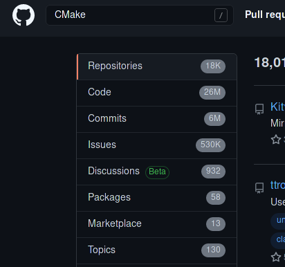

## 1. Qt6

时光荏苒，[Qt6 发布](https://www.qt.io/blog/qt-6.0-released) 已经是去年的事情，截止到写文章的时候 Qt 6.1 都已经发布很久

Qt5 和 6 之间一个重大的改变就是 Build System 从 qmake 转向了 CMake （太好了！），而后者有更多的 C/C++ 项目支持。
 

（这数量级之差不用我多说啥了吧）

Qt 6.0 主要的目标是 "能用就行"，因此他们只在 release 里面包含了 
 - `qtbase`，
 - `qtdeclarative`，
 - `qt5compat`，
 - `qtshadertools`，
 - `qtwayland` 和 `qtquick3d`  这些相对基础的组件。

Qt 6.1 在此基础上又增加了 
 - `qtcharts`， 
 - `qtdatavis3d`，
 - `qtimageformats`，
 - `qtnetworkauth`，
 - `qtvirtualkeyboard` 和 `qtlottie`

相比之下 6.1 包含的组件已经很多了

## 2. WASM

我心心念念的 Qt for WASM 还是没来。

后来看到 *[QTBUG-87471](https://bugreports.qt.io/browse/QTBUG-87471)* 才知道还得等到 Qt 6.2，这让我萌生了从源码编译的~~冲动~~

## 3. “能编译了吗？”

因为要编译的是 dev 分支的 Qt6，我决定用 git 拉源码，还能随时 `git pull` 到最新的版本，于是开始 clone

试了一圈发现 GitHub 的 [mirror](https://github.com/qt/qt5) 比较快 ~~(虽然 repo 叫 qt5 但他其实里面是 qt 的 dev 分支，简直太迷惑了)~~

```bash
$ git clone https://github.com/qt/qt5 --recursive # 使用 recursive 把所有 submodules 都拉下来！ 
```

「*哦淦，dev 分支没有文档啊*」

…… （冷场）

## 4. 藏在角落的编译文档

经过了 114514 小时的高强度搜索，终于在 [QTBUG-78647](https://bugreports.qt.io/browse/QTBUG-78647#comment-539018) 评论区找到了一点点编译参数的 Hints

于是立即开始 build, 看了看两个 notes 都跟我没关系嘛

- "*NOTE You need an ultra recent version of cmake*"
  - Arch 用户从来不担心版本太旧
- "*NOTE You will need to host build of Qt 6.0.x, easiest to download the binary release for your desktop platform. Building from git also works.*"
  - 喵？ 那我 `pacman -S qt6` 不就好了

## 5. 开搞！

拿来评论区的编译参数，稍微改了改，就变成了

```bash
cmake ~/Work/qt5/qtbase/ \
  -GNinja \
  -DFEATURE_developer_build=ON \
  -DFEATURE_headersclean=OFF \
  -DFEATURE_precompile_header=OFF \
  -DWARNINGS_ARE_ERRORS=OFF \
  -DBUILD_EXAMPLES=OFF \
  -DBUILD_TESTING=OFF \
  -DCMAKE_INSTALL_PREFIX=~/Work/qt-build/wasm-installed \
  -DCMAKE_TOOLCHAIN_FILE=~/.local/emsdk/upstream/emscripten/cmake/Modules/Platform/Emscripten.cmake \
  -DQT_HOST_PATH=/
```

Qt 的 CMake Configure 过程异常地耗时，于是漫长的等待开始了

⬅️ To Be Continued
