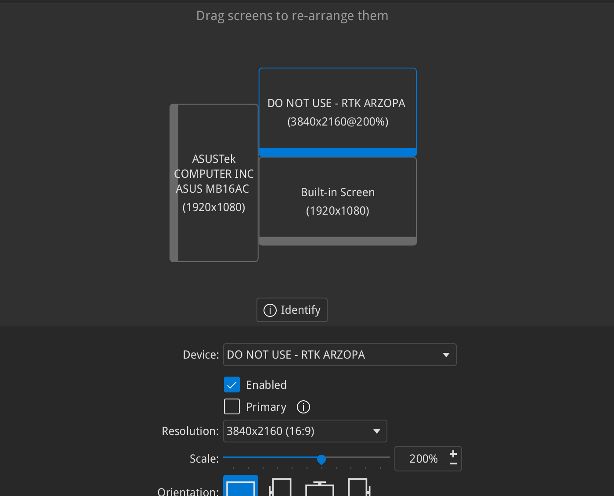
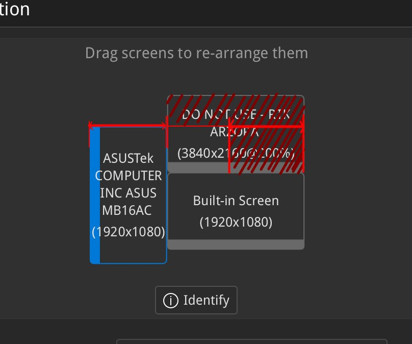
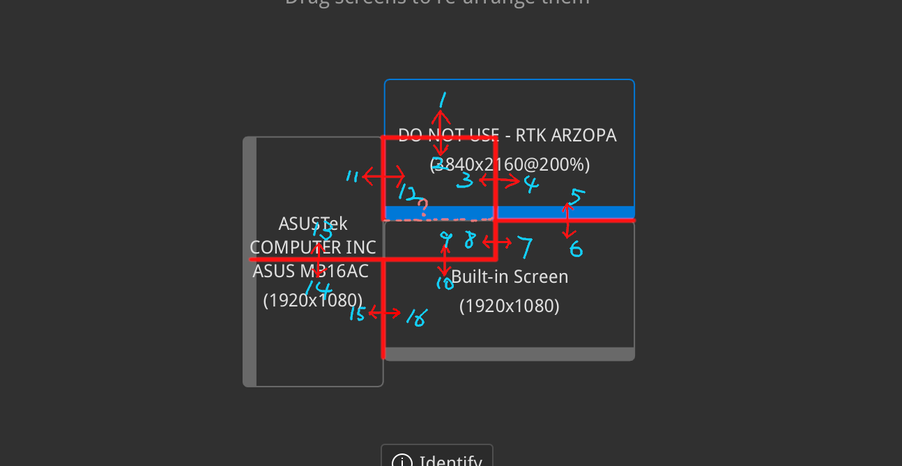

# 又一篇 Wayland 水文

从 X11 （再次）迁移到 Wayland 已经两三周了，这次是真的不愿回去了

## 相比于上次的更新

- krunner 不会莫名其妙无法启动了
- 微信已经可以从 Wayland 下的 Dolphin 拖动文件到聊天窗口了（不知道是 wine 还是 KDE 的 credit）
- VSCode / VMWare 屏幕不会闪烁了
- Global Application Menu 已经可以使用 Meta 键调出

## Wayland 下的其他问题

- latte-dock 已经不像之前那样无法启动了，但偶尔会出现 coredump，目前还不知道原因
- Flameshot 仍然无法截图

## 以及……小记一次 debug kwin

我的屏幕布局:

为方便起见，将屏幕从左到右，从上到下依次编号为 1、2、3。

- ASUSTek: 1
- Arzopa 4K: 2
- 内置屏: 3

上图可见 Arzopa 屏幕是高分屏，自从切换到 Wayland 后我在 KDE 的设置中将其缩放为 200%。但在使用过程中遇到一个奇怪的问题，见下图：

只有 Qt 窗口在深红色区域时，才会被绘制为 HiDPI 的样子，而在左下角区域（但并未出屏幕范围）的窗口则会使用 1080p 渲染，并进行 2x 缩放，导致模糊。

### 定位问题

首先我使用的是 Qt 与 GTK 程序渲染的对比，发现只有 Qt 程序会在「窗口完全进入高分屏后」才使用 HiDPI 渲染。相比之下 GTK 程序的行为是：只要
窗口的任意一部分进入高分屏，就会使用 HiDPI 渲染，其他未在高分屏上的部分，仍然使用 HiDPI 渲染，但进行 down scale。

所以我首先怀疑是 Qt 的问题。

经过从专业群友 c10s 处进行深度学习后，我得知了可以使用 `WAYLAND_DEBUG=1` 来开启 Wayland 的 debug 信息。于是先使用
`WAYLAND_DEBUG=1 konsole` 对 Konsole 窗口进行 debug。

随后我发现：

注：仅列出了部分边界处的 wayland 信息，~~问号处不重要~~。

其中：（数字代表 `wl_output` 区域，理论上 `wl_output` 代表一个屏幕）

| **_N_** | **+ 1** | **+ 2** | **+ 3** | **+ 4** | **+ 5**     | **+ 6**     |
| ------- | ------- | ------- | ------- | ------- | ----------- | ----------- |
| **00**  | 离 1    | 进 1    | 进 1    | 离 1    | 离 3 / 进 2 | 离 2 / 进 3 |
| **06**  | 离 1    | 进 1    | 进 1    | 离 1    | 离 2        | 进 2        |
| **12**  | 进 1    | 离 1    | 离 3    | 进 3    |             |             |

根据上表现象计算，会得出一些很有意思的现象：

- 14、15 区域内，窗口不属于任何屏幕（这不应该）
- 2、3、12 区域内，窗口属于 1、2 两个屏幕（这也不应该）
- 8、9 小矩形区域内，窗口属于 1、3 两个屏幕（这更不应该）

由此可见，Wayland 混成器发送的是错误的信息：

- 通过边界的大概位置可以看出：kwin 在判断窗口与屏幕 intersection 时疑似忘记计算屏幕朝向了。

### 修复问题

遂写了[此 patch](https://invent.kde.org/moodyhunter/kwin/-/commit/6ee442d1d1b5b70e3e06a7528d470c4ea1537042)，在计算
`Display::outputsIntersecting(const QRect &rect)` 时考虑屏幕朝向。

经过此 patch 后，问题得到了修复。

### 后续

发现 kwin 上游已经在 master 分支提交了此问题的更合理修复：[commit 1](https://invent.kde.org/plasma/kwin/-/commit/25466f9546dc9a2752708f4b1216088f1f0b7ef3)
和 [commit 2](https://invent.kde.org/plasma/kwin/-/commit/ed49d7c59bb3cc0983d2fe86973aaf8169266e1a?page=2#1120118b5c63d781de321067fb32acbd40cbc74f_315_283)，
但仍未 release、外加改动过多，目前临时使用了我自己的 patch。
