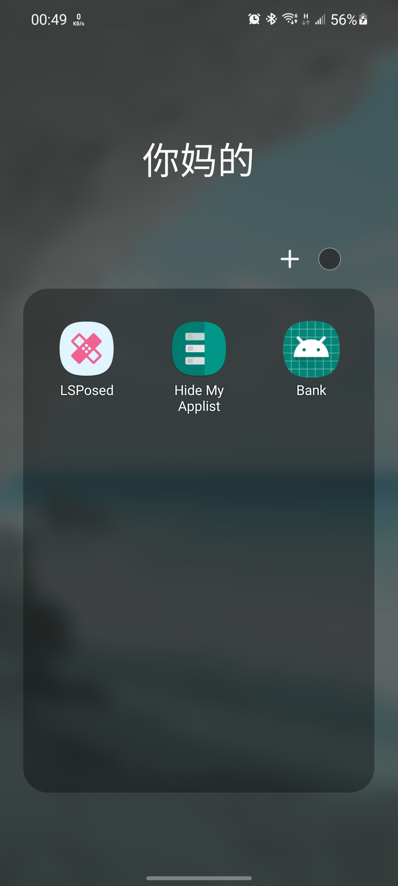

# "猫鼠游戏" 流水账

自从给手机解锁 bootloader 并启用 root 权限之后，咱的心智负担就每况愈下：

> 不知道哪次什么 App 升级了新型 电信诈骗(root) 检测机制，
> 又得花时间排错（

App 更新检测机制；Root 框架进行修补；App 再次更新；框架再次修补……

这似乎成了一个难以破解的死循环。

这不，事情又来了……

## 钱钱

几周前，~~因为没钱吃饭~~，我打开了 Lloyds bank 的手机 app 查看余额，结果出现了一行大字：

> Sorry, you can't use this app as we've detected that your device has been kailbroken/rooted.
> You can still use our Mobile Banking or Internet Banking sites via your web browser.

寄了。

---

穷途末路，Google 上搜也没搜到结果。于是开始胡乱尝试：

## 1. 删了 Magisk

删掉 Magisk 后观测到 app 可以正常打开，但这根本不在我的可选解决方案内。我用了 `MagiskHide Prop Config` 换了设备
的 fingerprint（不然 Google Pay 用不了），如果整个 Magisk 卸载的话~~咱就更没法吃饭了~~。

## 2. 又把 Magisk 装回来

Banking App 可以没有，但是 root 和 Google Pay 不能。所以我又把 Magisk 装回来了。

在这期间就没怎么管它，直到今天。

## 3. Shamiko

经过与朋友的交谈，发现了 Shamiko。据说能 **_Hide more trace of Zygisk_**。不过因为是闭源的，那位朋友自己没尝试过，
只是在交谈中提及了一下。

结果配置了 Shamiko 后发现仍然 app 无法正常工作。

## 4. Island (Insular)

这玩意开了个沙盒，可以给指定的 Apps 构造独立的运行环境。可惜经过了几次尝试，没能成功启动。

## 5. 冻结重命名后的 Magisk App

XDA forum 里有推荐冻结住 Magisk Manager，但测试过后仍未果。

## 6. Hide My Applist

新的曙光出现了！

<https://forum.xda-developers.com/t/how-to-bypass-lloyds-and-santander-root-detection.3837206/post-87849927>

就在 Dec 12 （一周前），有人成功使用 `Hide My Applist` 修复了这个问题，那我也来试试。

发现仍然不行。

## 7. 仍然是 Hide My Applist

在仔细研究了它的 Hide My Applist 配置以后，我发现他用的是 blacklist 模式，也就是仅从 applist 里移除某些 apps，
咱闲来无事，就想：

> 我 tm 干脆给你整个白名单

于是把 Lloyds Bank 对应的规则改为了白名单模式，仅让其能检测到一些系统应用。

重启手机，发现竟然能打开了！

## 收尾

Lloyds Bank 在本月 8 号发了一个[新版](https://www.apkmirror.com/apk/lloyds-banking-group-plc/lloyds-bank-mobile-banking/)，
名曰 104.03。就是这个版本他们 _"fixed some bugs and added **security updates**."_ 导致 app 打不开。

至于为什么改成白名单就能正常工作……估计是还新增检测了一些别的应用吧？

**_不管怎么说，我终于能看到我的个位数余额了_**

把 Magisk Manager 重命名成了 Bank，记录此次事件：

