> 多图预警

2022 年是我在英国的第一个整年，我于 2021 年 9 月份来英国读大二 （~~感谢疫情~~，让孩子没有开学典礼），

### 1 月

咱的 Qt 杯子到了：

做了一个 PiScreen：

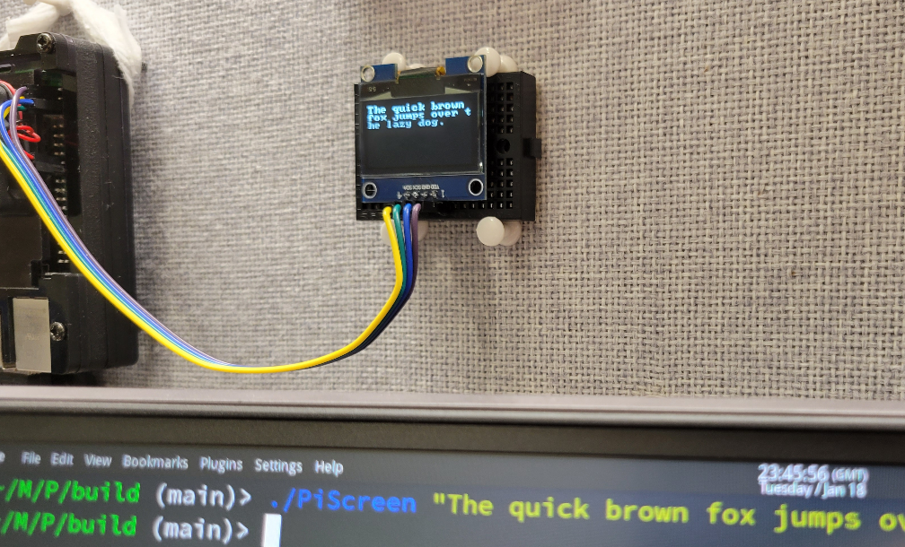

以及，整活 Qt：

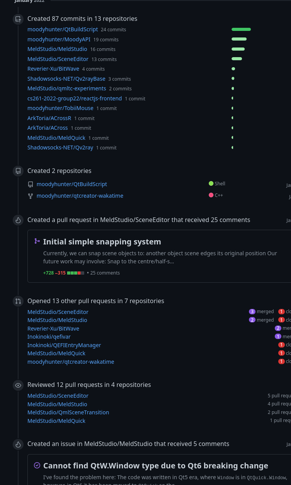

### 2 月

云：

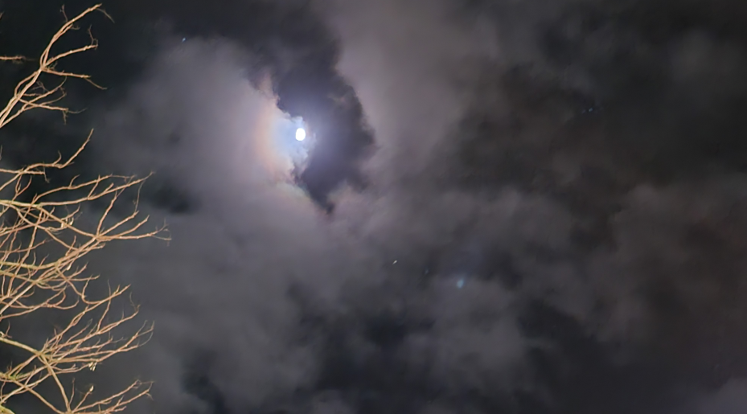

一只鹅：

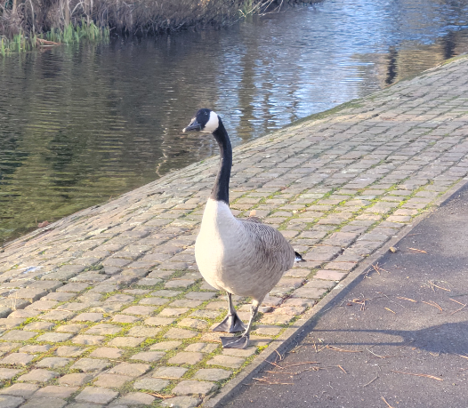

我的第一次 OSDev 体验：

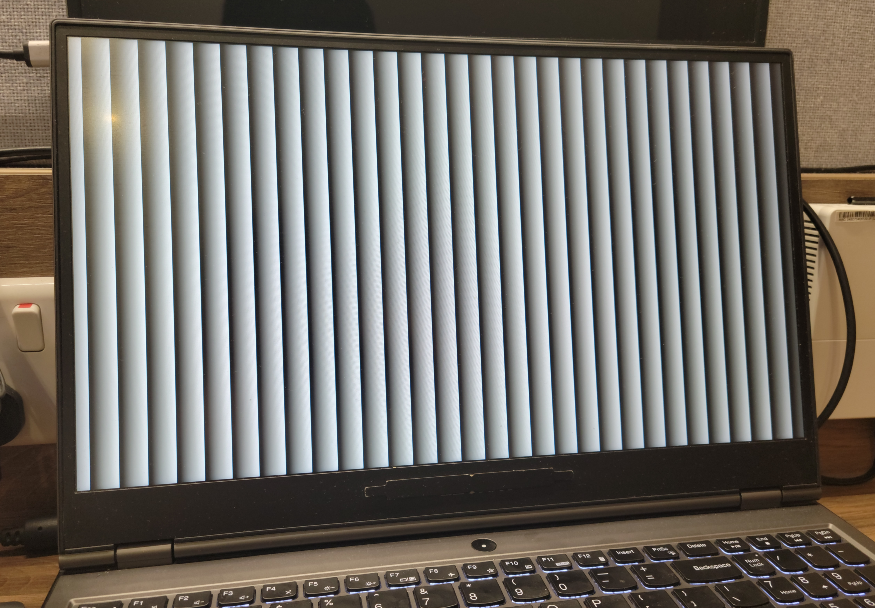

以及在小组作业里疯狂输出：

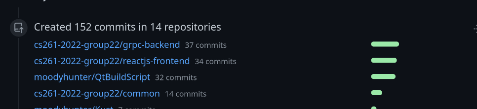

### 3 月

购入了一块 4K 屏幕，使用感觉良好

被插满了：

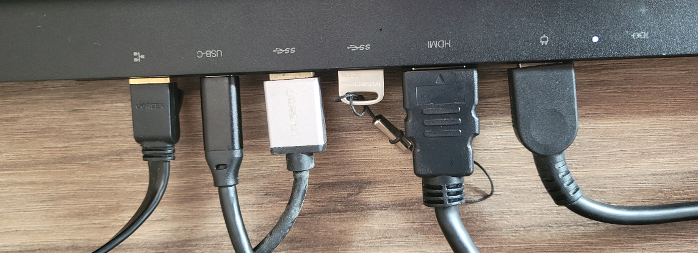

继续在小组作业里输出：

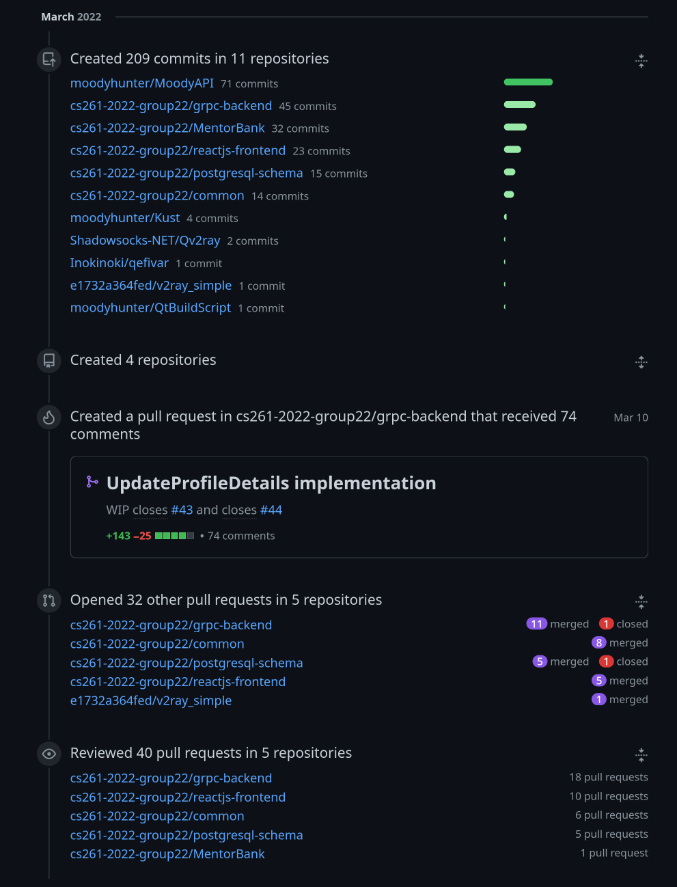

### 4 月

平平无奇，春假过得很开心：

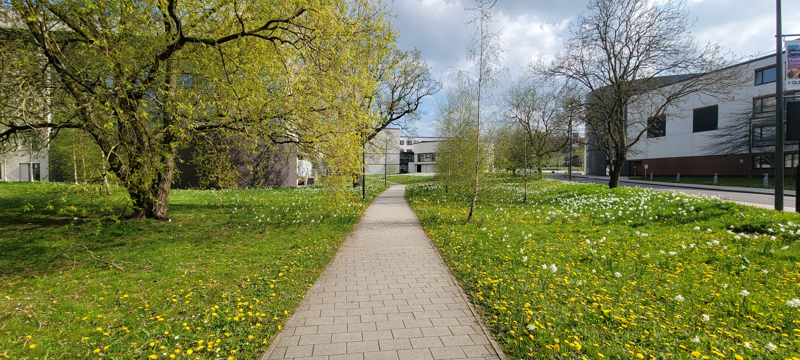

加入了 PLCTLab。遇到了诸位大佬，并开始了实习。

启动了 qmlls 的部分工作。

### 5 月

考试（

### 6 月

买了 Flight Simulator：

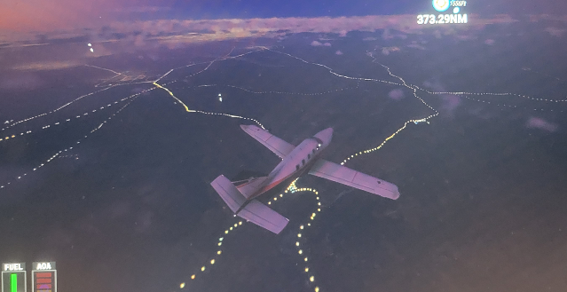

咱开始写 MOS 了！

### 7 ～ 8 月

暑假，PLCT，和更多的 MOS：

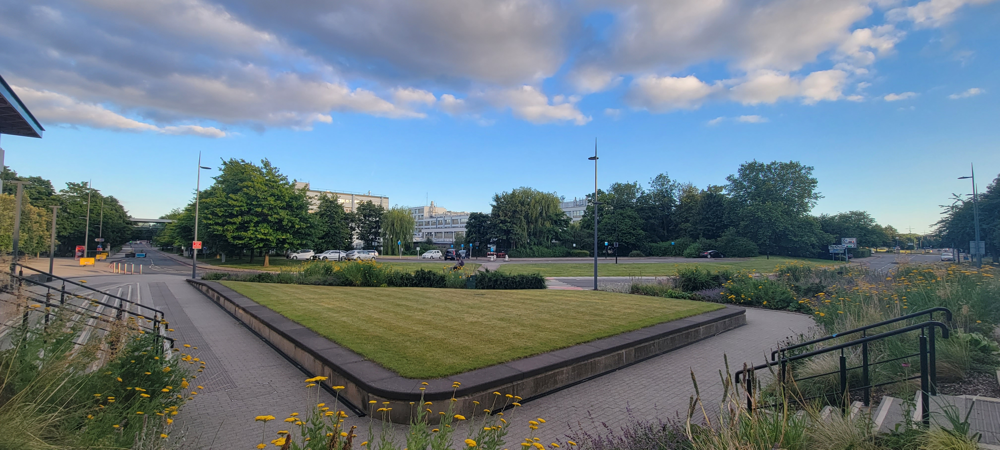

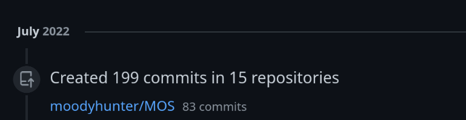

以及：

MOS 终于成功进入了 userspace：

### 9 月

去了浪漫的土耳其 :)

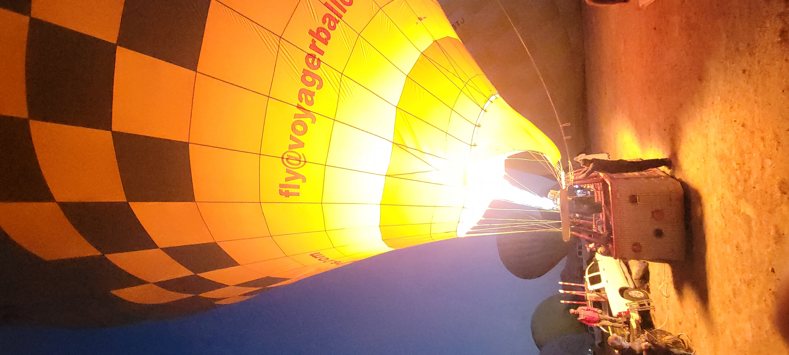
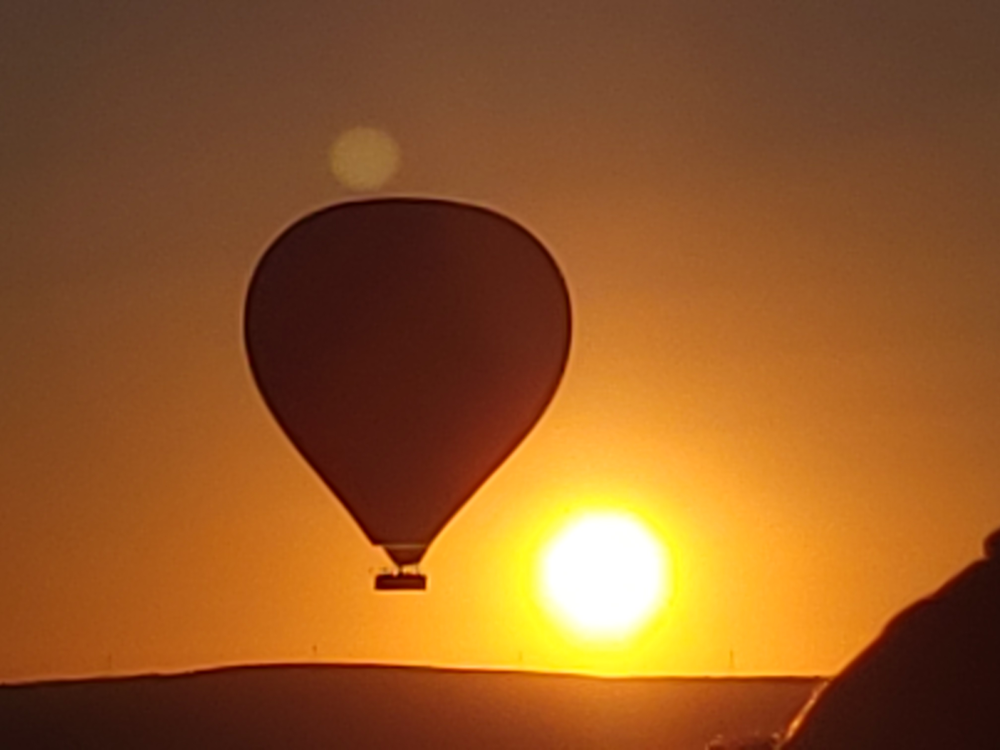

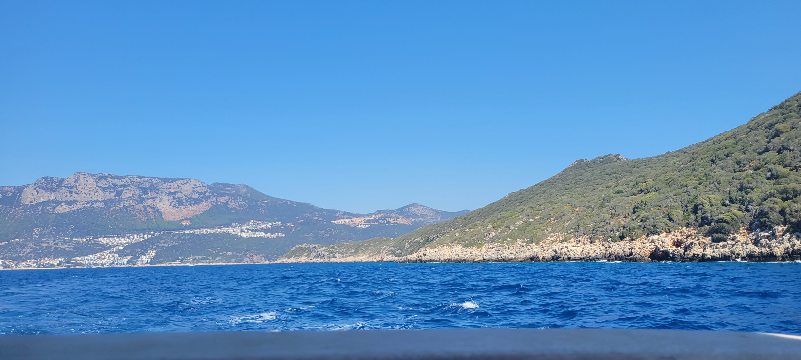
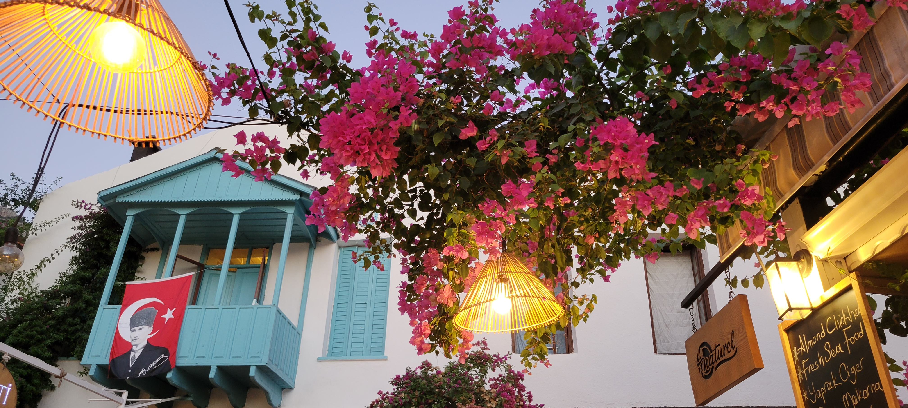
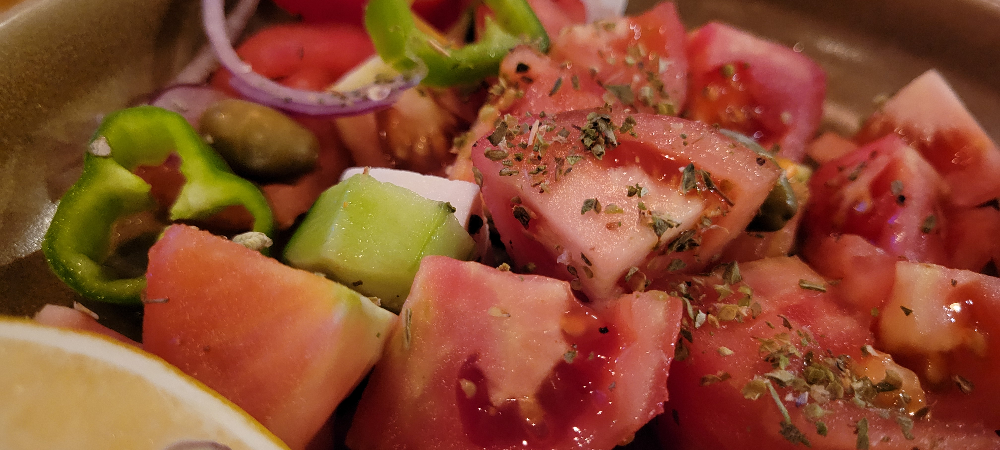
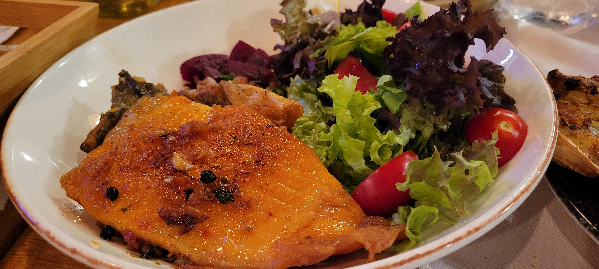
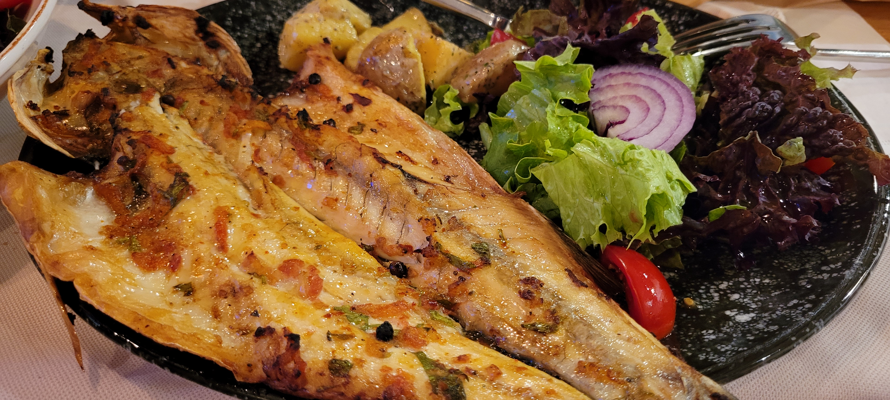

### 10 ～ 11 月

成功晋级为大三学生（不会有人每天四节课吧，不会吧不会吧不会吧不会吧不会吧不会吧不会吧不会吧不会吧不会吧不会吧不会吧不会吧不会吧
不会吧不会吧不会吧不会吧不会吧不会吧不会吧不会吧不会吧不会吧不会吧不会吧不会吧不会吧不会吧不会吧不会吧不会吧不会吧不会吧不会吧不会吧
不会吧不会吧不会吧不会吧不会吧不会吧不会吧不会吧不会吧不会吧不会吧不会吧不会吧不会吧不会吧不会吧不会吧不会吧不会吧不会吧不会吧不会吧
不会吧不会吧不会吧不会吧不会吧不会吧不会吧不会吧不会吧不会吧不会吧不会吧不会吧不会吧不会吧不会吧不会吧不会吧不会吧不会吧不会吧不会吧
不会吧不会吧不会吧不会吧不会吧不会吧不会吧不会吧不会吧不会吧不会吧不会吧不会吧不会吧不会吧不会吧不会吧不会吧不会吧不会吧不会吧不会吧
不会吧不会吧不会吧不会吧不会吧不会吧不会吧不会吧不会吧）

忙于上课，没啥值得记录的（

### 12 月

MOS 取得了不错的进展

恐怖的第一学期终于过了

和女朋友旅游 :)

趁她睡着的时候拍了她的一撮头发：

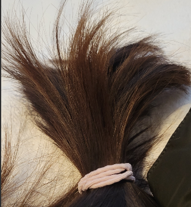

## Conclusion

2022 过的很快。上次跨年还是在上次，下次跨年估计就是下次了。

整体来看，上半年过的很快乐，下半年过的很充实。

现在已经是本科最后一学期了，希望能给本科画个圆点的句号，不过还有个研究生没上。
