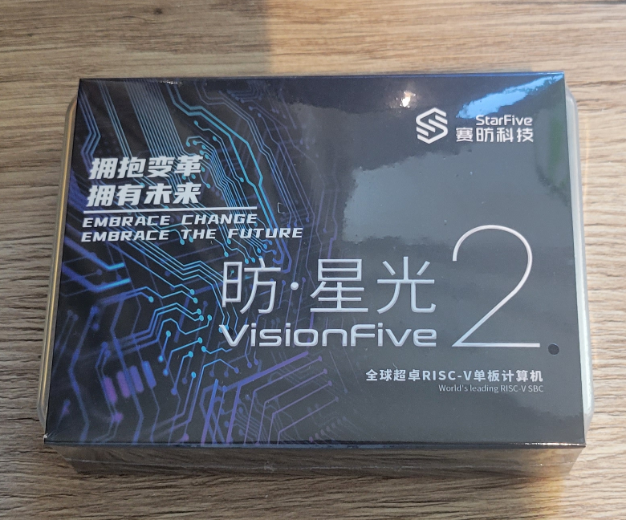
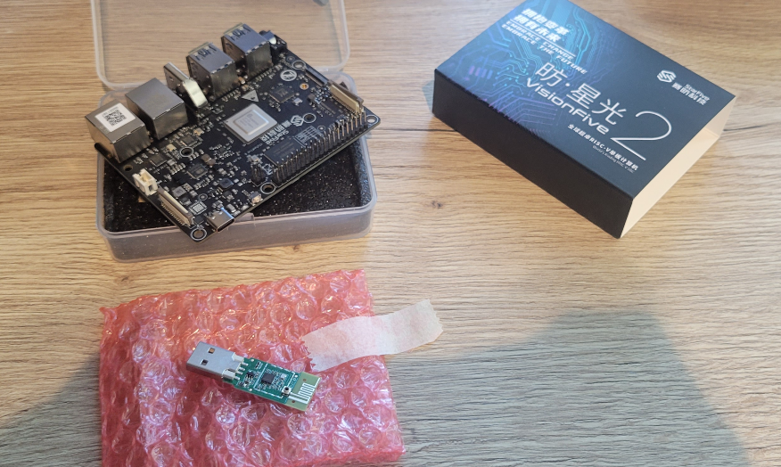
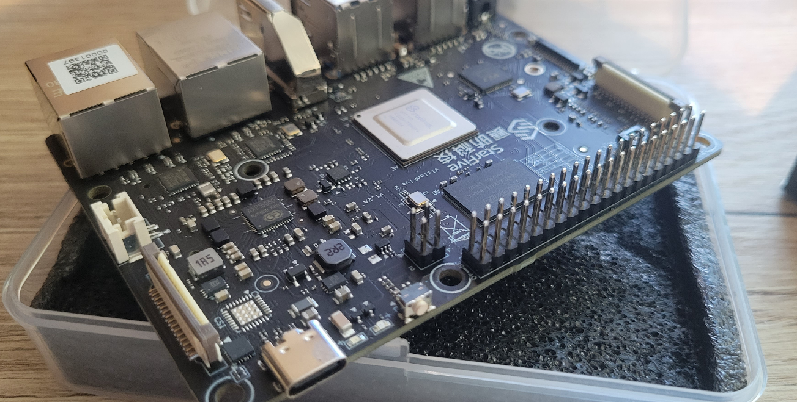
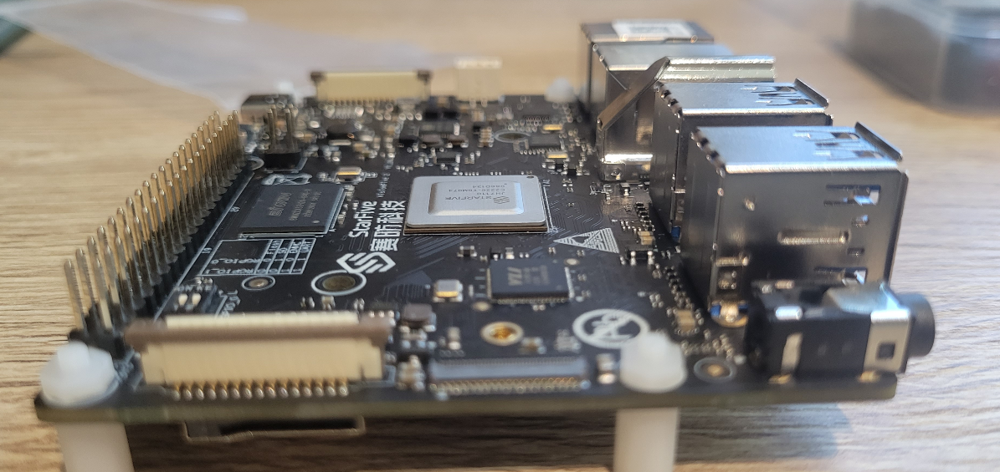
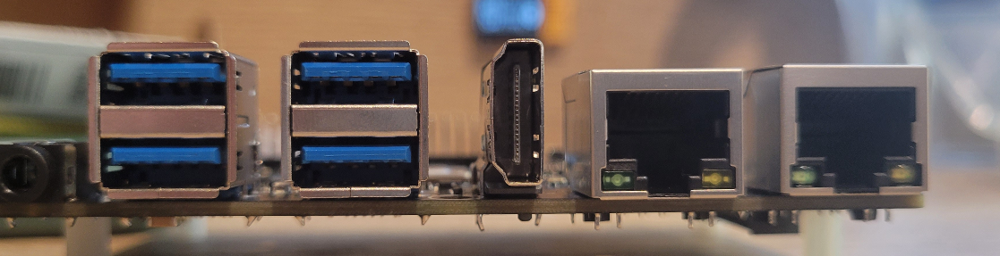
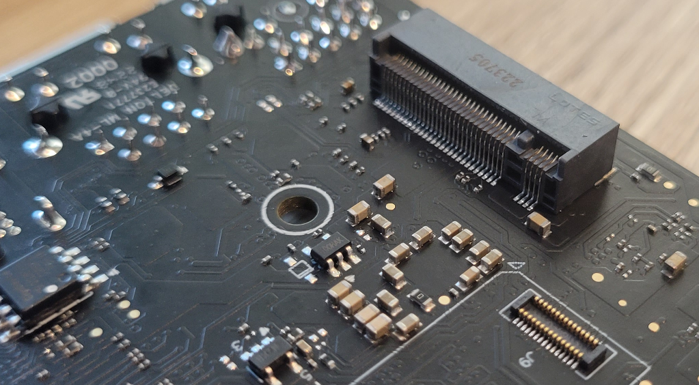
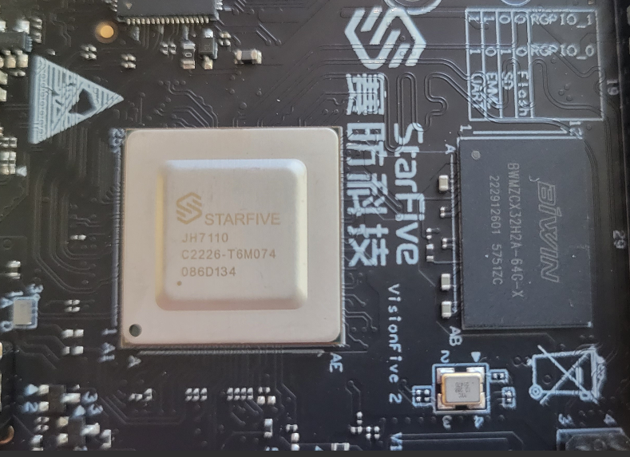
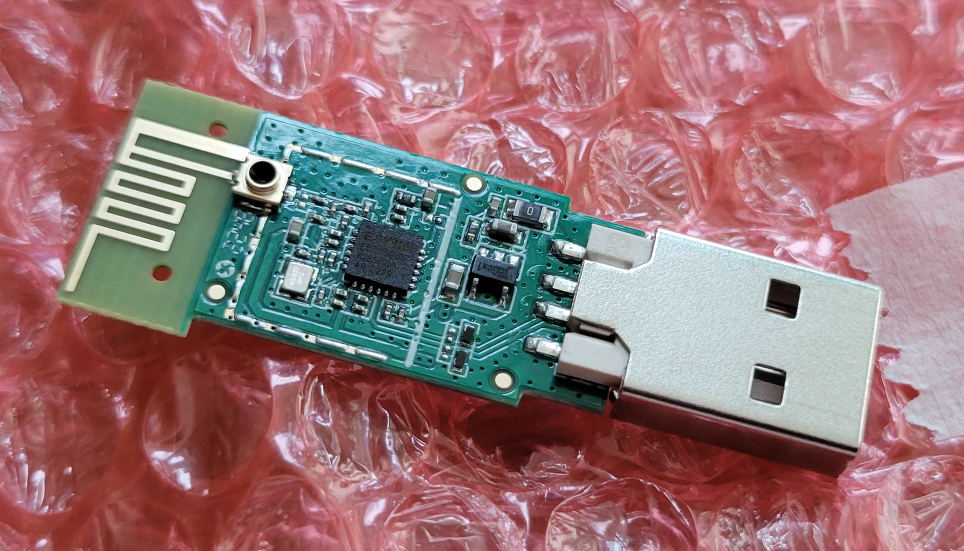
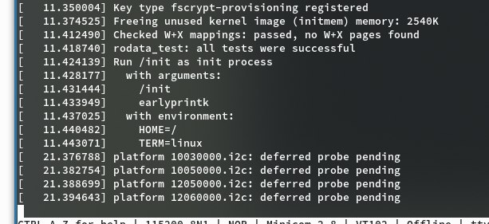

心心念念的 VisionFive 2 板子终于收到了

> （其实早就到了，只是我当时在加拿大 🍁 没法取用）

首先放几张图：















因为板子上没有 WiFi 模块，所以花钱给了个



```log
[383047.947883] usb 1-1.3: Product: 6600U
[383047.947904] usb 1-1.3: Manufacturer: ESWIN
[383047.947924] usb 1-1.3: SerialNumber: 6600U
```

## 主线内核支持情况

基本没有：<https://wiki.rvspace.org/en/project/JH7110_Upstream_Plan>

## 安装 Arch

- 首先需要一张 SD 卡（U-boot 似乎不能直接从 NVMe 引导）
- 标准 Arch 安装流程
- 然后卡在了 init
  
  再也起不来

> 原因其实很简单，对应的代码在 Arch Kernel 里没有，不过这一点是之后才意识到的

## 官方 Debian 内核

于是目光转向了“StarFive 官方”发布的 Debian 内核，替换好 kernel 和 initrd 之后开机，发现可以正常工作。

不过，因为 initrd 里的模块有限，而 rootfs 是 Arch，Debian 内核需要的各种模块（如 `btrfs` 无法被正确加载）

这直接导致 btrfs 人用不了 btrfs）

## 自行编译内核

按理来说应该是很简单的……

1. 上游 config 抄过来
2. 替换一下 Arch 的 PKGBUILD
3. 最后 makepkg
4. 再最后 pacman -U ...

首先就遇到了内核编译失败……（说实话咱也不确定这个分支对不对）

<https://github.com/starfive-tech/linux/blob/JH7110_VisionFive2_devel/drivers/gpu/drm/i2c/tda998x_pin.c#L33>f

```diff
-MODULE_DEVICE_TABLE(of, starfive_drm_dt_ids);
+MODULE_DEVICE_TABLE(of, tda998x_rgb_dt_ids);
```

修好这个问题以后，~~就遇到了更多问题~~

新版 pahole 改了行为，编译旧版 Kernel 需要加一些 flags：<https://github.com/torvalds/linux/commit/9741e07ece7c#diff-d801ca7968dc54e8304d53e0448d55f59098daf387330f030e6099e4283fcf96L43-R43>

值得一提的是，上游默认配置把网卡驱动设置成了 `y`，我一开始不知道为啥，改成了 `m` 导致网卡驱动
无法自动加载，将其改回 `y` 后终于能正常使用了：

```env
moody@MoodyVF2 ~> zgrep STARFIVE /proc/config.gz
CONFIG_SOC_STARFIVE=y
# CONFIG_SOC_STARFIVE_VIC7100 is not set
CONFIG_SOC_STARFIVE_JH7110=y
CONFIG_DWMAC_STARFIVE_PLAT=y # <<============ 就是这个
# CONFIG_HW_RANDOM_STARFIVE is not set
CONFIG_SPI_PL022_STARFIVE=y
CONFIG_PINCTRL_STARFIVE=y
CONFIG_PINCTRL_STARFIVE_JH7110=y
CONFIG_GPIO_STARFIVE_JH7110=y
CONFIG_STARFIVE_WATCHDOG=y
CONFIG_REGULATOR_STARFIVE_JH7110=y
CONFIG_STARFIVE_INNO_HDMI=y
CONFIG_STARFIVE_DSI=y
CONFIG_SND_SOC_STARFIVE=y
CONFIG_SND_SOC_STARFIVE_PWMDAC=y
CONFIG_SND_SOC_STARFIVE_PWMDAC_PCM=y
CONFIG_SND_SOC_STARFIVE_I2S=y
CONFIG_SND_SOC_STARFIVE_PDM=y
CONFIG_SND_SOC_STARFIVE_TDM=y
CONFIG_SND_SOC_STARFIVE_SPDIF=y
CONFIG_SND_SOC_STARFIVE_SPDIF_PCM=y
CONFIG_USB_CDNS3_STARFIVE=y
CONFIG_MMC_DW_STARFIVE=y
CONFIG_RTC_DRV_STARFIVE=y
CONFIG_DW_AXI_DMAC_STARFIVE=y
CONFIG_CLK_STARFIVE_JH7110=y
CONFIG_CLK_STARFIVE_JH7110_VOUT=y
CONFIG_CLK_STARFIVE_JH7110_ISP=y
CONFIG_CLK_STARFIVE_JH7110_PLL=y
CONFIG_STARFIVE_TIMER=y
CONFIG_STARFIVE_MBOX=m
CONFIG_STARFIVE_MBOX_TEST=m
CONFIG_STARFIVE_PMU=y
CONFIG_PWM_STARFIVE_PTC=y
CONFIG_RESET_STARFIVE_JH7110=y
CONFIG_RISCV_STARFIVE_CPUFREQ=y
```

至于 Linux Kernel 只认出了 4GB 内存的问题，目前还没见到其他的解法。

我干脆直接改了 dtb：

```diff
memory@40000000 {
    device_type = "memory";
-    reg = <0x00 0x40000000 0x01 0x00>;
+    reg = <0x00 0x40000000 0x02 0x00>;
};
```

之后 `make dtbs` 重新生成了 dtb 并放到对应位置

## 成果展示

### neofetch

`````log
                   -`                    moody@MoodyVF2
                  .o+`                   --------------
                 `ooo/                   OS: Arch Linux riscv64
                `+oooo:                  Host: StarFive VisionFive V2
               `+oooooo:                 Kernel: 5.15.0-3-vf2
               -+oooooo+:                Uptime: 4 days, 12 hours, 37 mins
             `/:-:++oooo+:               Packages: 319 (pacman)
            `/++++/+++++++:              Shell: fish 3.6.0
           `/++++++++++++++:             Terminal: /dev/pts/0
          `/+++ooooooooooooo/`           CPU: (4) @ 1.500GHz
         ./ooosssso++osssssso+`          Memory: 196MiB / 7885MiB
        .oossssso-````/ossssss+`
       -osssssso.      :ssssssso.
      :osssssss/        osssso+++.
     /ossssssss/        +ssssooo/-
   `/ossssso+/:-        -:/+osssso+-
  `+sso+:-`                 `.-/+oso:
 `++:.                           `-/+/
 .`                                 `/
`````

### uname -a

```log
Linux MoodyVF2 5.15.0-3-vf2 #1 SMP PREEMPT Wed, 25 Jan 2023 18:44:54 +0000 riscv64 GNU/Linux
```

### free -h

```log
               total        used        free      shared  buff/cache   available
Mem:           7.7Gi       191Mi       7.1Gi       2.0Mi       391Mi       7.3Gi
Swap:           25Gi          0B        25Gi
```

### lscpu

```log
Architecture:          riscv64
  Byte Order:          Little Endian
CPU(s):                4
  On-line CPU(s) list: 0-3
NUMA:
  NUMA node(s):        1
  NUMA node0 CPU(s):   0-3
```

### cat /proc/cpuinfo

```log
processor   : 0
hart        : 1
isa     : rv64imafdc
mmu     : sv39
isa-ext     :
uarch       : sifive,u74-mc
...
```

### lspci -v

```log
0000:00:00.0 PCI bridge: PLDA XpressRich-AXI Ref Design (rev 02) (prog-if 00 [Normal decode])
        Flags: bus master, fast devsel, latency 0, IRQ 58
        Bus: primary=00, secondary=01, subordinate=01, sec-latency=0
        Memory behind bridge: 30000000-300fffff [size=1M] [32-bit]
        Capabilities: <access denied>
        Kernel driver in use: pcieport

0000:01:00.0 USB controller: VIA Technologies, Inc. VL805/806 xHCI USB 3.0 Controller (rev 01) (prog-if 30 [XHCI])
        Subsystem: VIA Technologies, Inc. VL805/806 xHCI USB 3.0 Controller
        Flags: bus master, fast devsel, latency 0, IRQ 66
        Memory at 30000000 (64-bit, non-prefetchable) [size=4K]
        Capabilities: <access denied>
        Kernel driver in use: xhci_hcd
        Kernel modules: xhci_pci

0001:00:00.0 PCI bridge: PLDA XpressRich-AXI Ref Design (rev 02) (prog-if 00 [Normal decode])
        Flags: bus master, fast devsel, latency 0, IRQ 60
        Bus: primary=00, secondary=01, subordinate=01, sec-latency=0
        Memory behind bridge: 38000000-380fffff [size=1M] [32-bit]
        Capabilities: <access denied>
        Kernel driver in use: pcieport

0001:01:00.0 Non-Volatile memory controller: Micron/Crucial Technology P2 NVMe PCIe SSD (rev 01) (prog-if 02 [NVM Express])
        Subsystem: Micron/Crucial Technology Device 5021
        Flags: bus master, fast devsel, latency 0, IRQ 59, NUMA node 0
        Memory at 38000000 (64-bit, non-prefetchable) [size=16K]
        Capabilities: <access denied>
        Kernel driver in use: nvme
```

### lsusb -t

```log
/:  Bus 02.Port 1: Dev 1, Class=root_hub, Driver=xhci_hcd/4p, 5000M
/:  Bus 01.Port 1: Dev 1, Class=root_hub, Driver=xhci_hcd/1p, 480M
    |__ Port 1: Dev 2, If 0, Class=Hub, Driver=hub/4p, 480M
```
