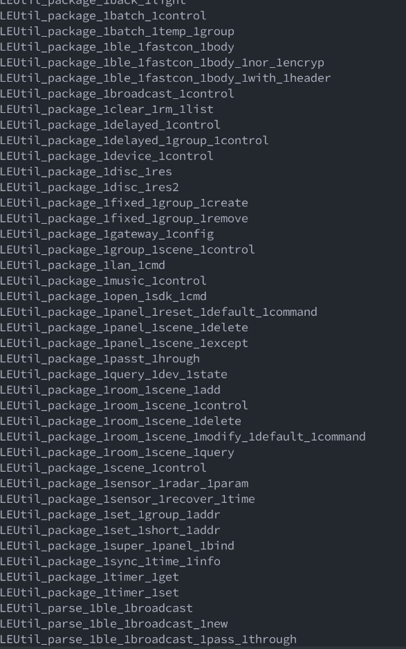
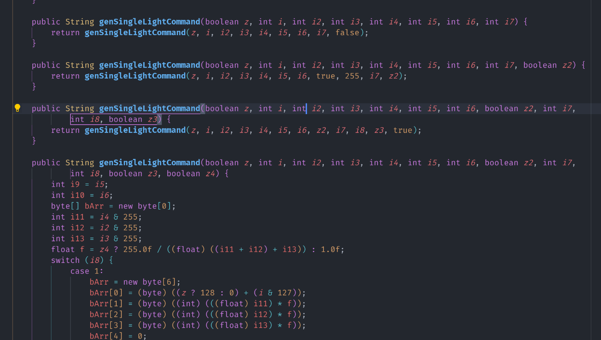
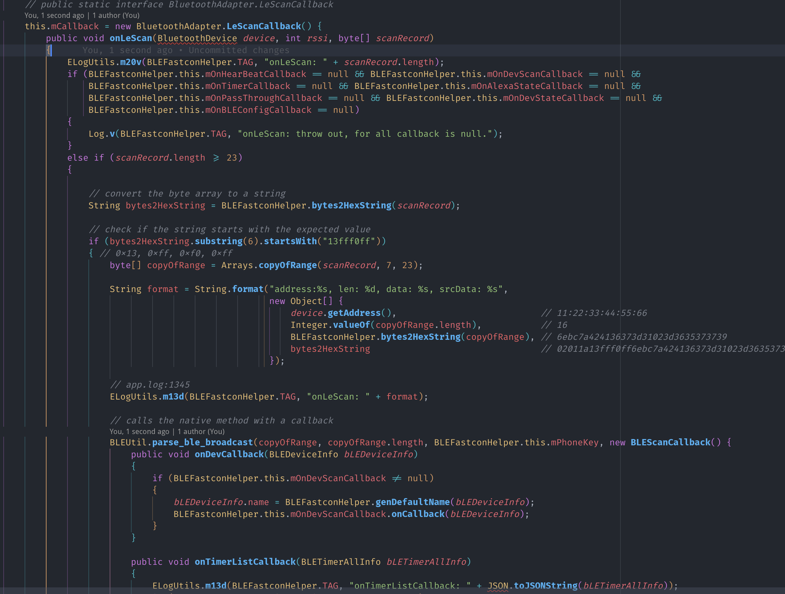
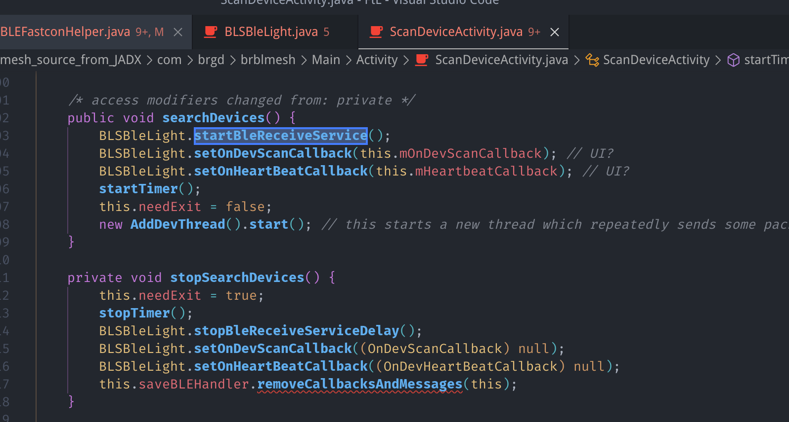
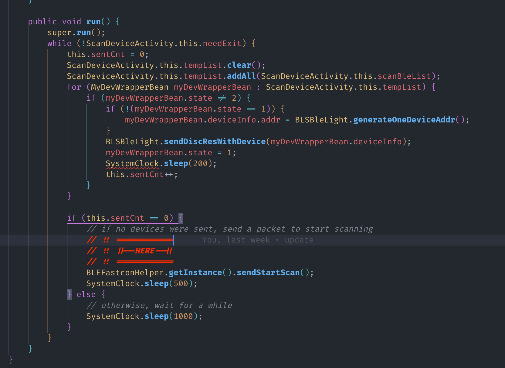
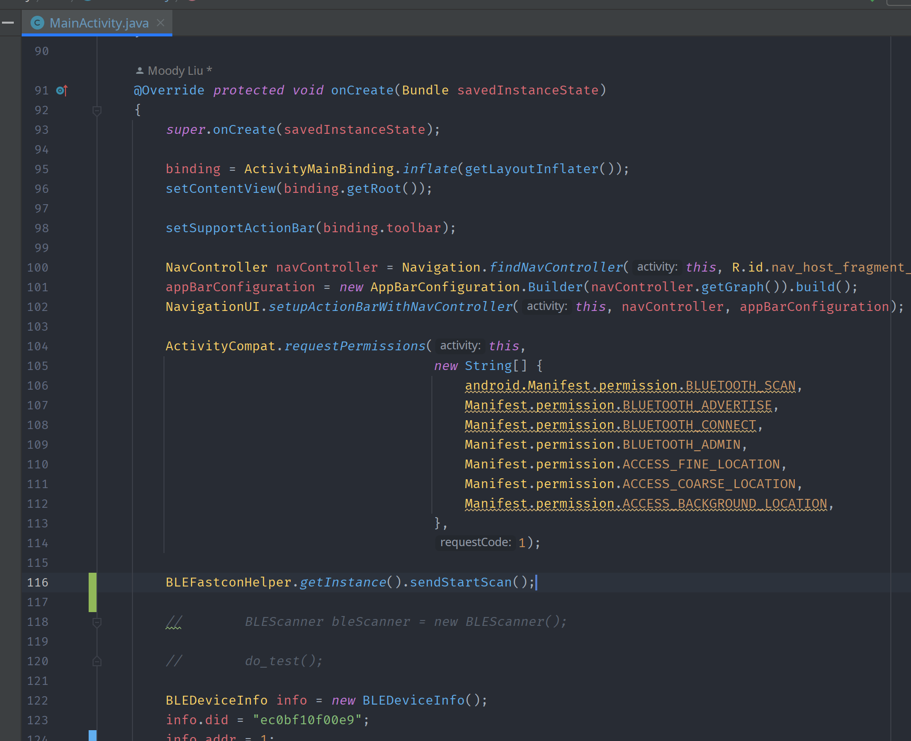
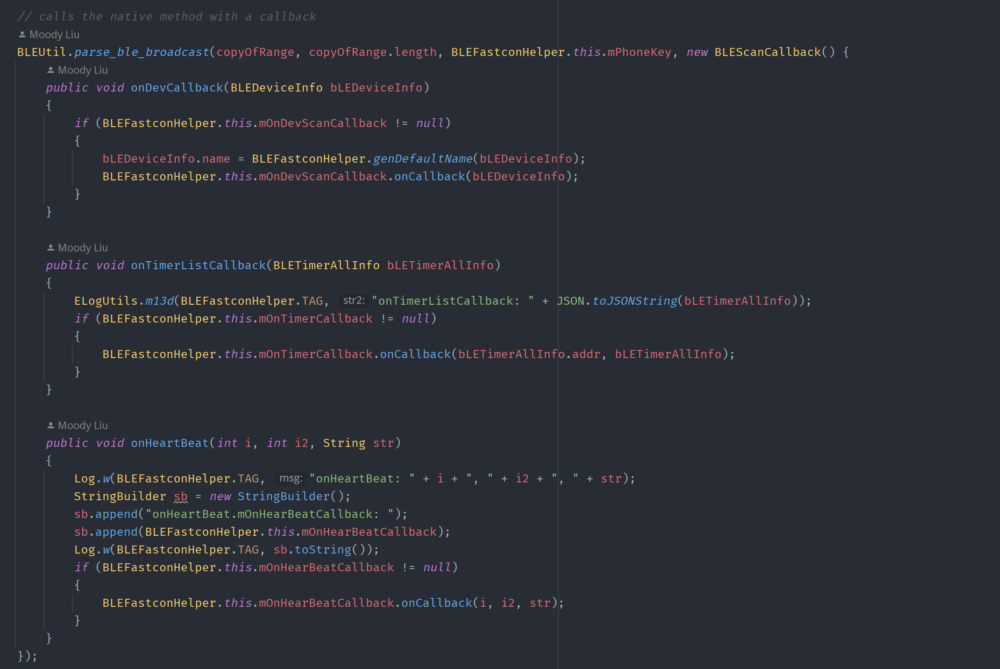
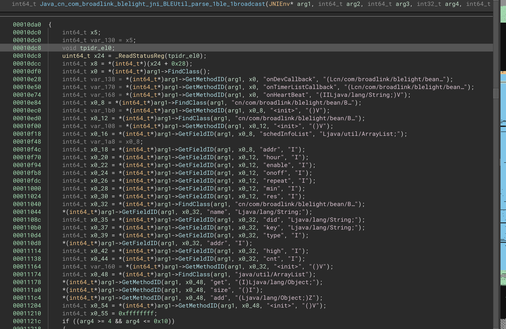
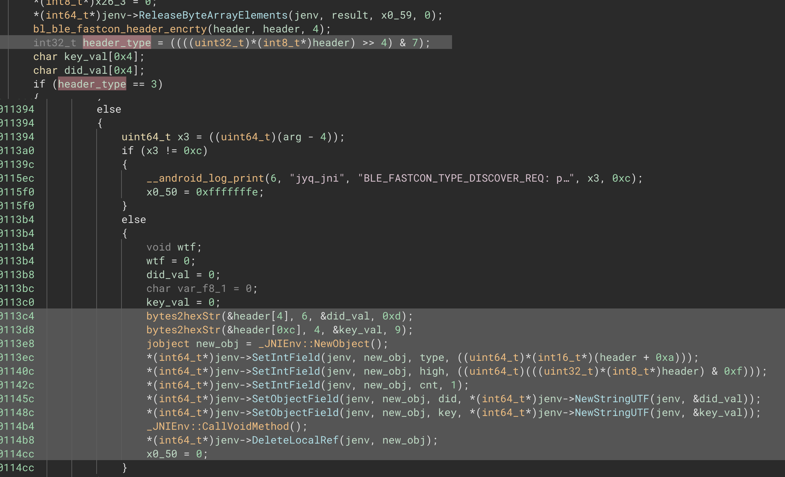

**本文内容不得用于商业用途**

## 前情提要

[MoodyAPI](https://github.com/moodyhunter/MoodyAPI) 里面有一个组件 `LightController`

TlDr：控制一个 BLE 灯泡。

可惜的是，之前那只灯泡坏了（~~都是去年的事了~~）。鄙人只好又在 Amazon 上重新
买了[另一只同样的](https://www.amazon.co.uk/gp/product/B07RL79ZDS)：


去年 12 月 18 买的，没两天就收到了。收到灯泡之后整个人就傻掉了。

> 同一款灯泡，为什么通信协议完全不一样了呢？

上次的灯泡使用的是蓝牙 BLE GATT 协议，其[暴露了两个 Service 用于控制颜色，亮度等参数](https://github.com/moodyhunter/MoodyAPI/blob/b8870165546dcb390b674a9a1229f88af6e3a3d0/LightControl/src/main.rs#L43-L52)。

但这次的灯泡完全不一样，甚至连[用于控制的 App](https://play.google.com/store/apps/details?id=com.xiaoyu.hlight)
都[无法通用](https://play.google.com/store/apps/details?id=com.brgd.brblmesh)。

查询了各大论坛，也发现这种新型 Fastcon 协议[并没有](https://community.home-assistant.io/t/broadlink-fastcon-ble-support/486815/6)[开源实现](https://www.reddit.com/r/homeassistant/comments/znj7aq/broadlink_fastcon_ble_support_yet/)

那么，是退货，还是逆向这个闭源协议呢？

## 你猜？

当然是逆向了

## 1. 获取 APK

这第一步自然是相当容易，有什么好说的

## 2. 反编译 Java 类

这一步也很简单，甚至随便找了个 [online 的 decompiler](http://www.javadecompilers.com/) 就
拿到（部分）源码了。

## 3. 源码分析

在解包 APK 的时候，我意外发现了一个 native 库，`libbroadlink_ble.so`。

看到 JNI，我的脑子就开始发毛，这不是要逆向 C/C++ 代码了吗？（悲）

### 3.1 Java 类

程序里有数个名称带有 `Fastcon` 的类，其中 `BLEFastconHelper` 似乎是最重要的一个，包含所有
`Fastcon` 设备无关的逻辑，`BLSBleLight` 似乎是专门用于智能灯泡的封装类。

另外，程序内还有一个 `cn.com.broadlink.blelight.jni.BLEUtil` 类，里面全都是 native 方法
的声明。

### 3.2 `libbroadlink_ble.so`

一个神秘 native 库，看了看里面有 47 个 JNI 函数，多数都是用于数据的打包：



## 4. 开始分析 `BLEFastconHelper` 的扫描设备逻辑

这个长达两千多行的类里面的函数名倒是很 self-explanatory，但其中函数的参数名则是一团乱麻。



### 4.1 如何扫描设备

`BLEFastconHelper` 里面有一个 `startScanBLEDevices` 函数，用于（开始）扫描设备。

```java
public boolean startScanBLEDevices()
{
    stopCloseBLETimer();
    BluetoothAdapter bluetoothAdapter = this.myAdapter;
    if (bluetoothAdapter == null) {
        return false;
    }
    boolean started = bluetoothAdapter.startLeScan(this.mCallback);
    Log.w(TAG, "start LeScanCmd: " + started);
    return true;
}
```

没啥用，但 `bluetoothAdapter.startLeScan` 就直接进入 Android 的蓝牙 API 了，所以
查看一下 `this.mCallback` 的值。



上面代码是分析过后，包含了合理变量名和注释的版本，可以看到在 `mCallback` 内比较了蓝牙 Advertising
数据的长度和第 7-11 个字节（`13fff0ff`），如果相等则进行下一步处理。

那么我能不能在电脑上也进行这样的扫描，并直接获取到这些数据呢？

---

**A Million Years Later**

---

答案是不行。在电脑，树莓派以及手机的某**些** BLE Scanner 上都无法扫描到这个设备。

### 4.2 "Scan Request"

在这种情况下，扫描器会主动向设备发送一个请求，然后设备才会返回数据。

我需要看看在调用 `startLeScan` 之前，扫描器是否有发送过这样的请求。

果不其然，在 `ScanDeviceActivity` 中发现了玄机：



在这个函数的最后，他启动了一个 `AddDevThread` 线程，在后者的 `run` 函数中，扫描器会
向设备发送一个 `Scan Request`：



其中：

```java
public boolean sendStartScan()
{
    byte[] bArr = new byte[12];
    bArr[0] = 0;
    return sendCommand(0, bArr, (byte[]) null, BLE_CMD_RETRY_CNT,
        -1, false, false, false, 0);
}
```

🤡 `-1`, `false`, `false`, `false`, `0` 🤡

函数层层调用，一团乱麻般的参数，最终会被传递到 `doSendCommand` 函数中：

```java
sendStartScan()
sendCommand(0, bArr, (byte[]) null, 1, -1, false, false, false, 0);
sendCommand(0, data, null, 1, -1, false, false, 0, false, false, 0);
doSendCommand(0, data, null, 1, -1, false, false, false, false, 0);
```

`doSendCommand` 函数再次调用 `getPayloadWithInnerRetry` 函数，这个函数进而调用了
native 方法 `package_ble_fastcon_body`，返回的数据被传递到一个名叫 `sHandler`
的 `Handler` 中。

`sHandler` 获取到数据后，调用另一个函数签名的 `doSendCommand` 函数，在这里我将其重命名为
`XdoSendCommand`，在这个函数中，数据包被再次传递到 native 库函数 `get_rf_payload`，
并最终使用 `bluetoothLeAdvertiser2.startAdvertising` 被发送出去。

### 4.3 "Scan Response"

只有理论分析当然不够，我还需要进行真正的测试。

于是把代码 Ctrl+C/Ctrl+V 到了一个新的 Android 项目中，然后改改改改改改改改改改改改改改改改改改一些
编译错误，终于可以运行了。



我在 MainActivity 手动添加了一个 `BLEFastconHelper.getInstance().sendStartScan();` 调用，
然后运行程序，果然在电脑上收到了设备发来的响应：

```log
Manufacturer data: {65520: [
    78, 109, 122, 172, 236, 11, 241,  15,
     0, 233, 161, 168,  94, 54, 123, 196
]}
```

因此推测，Fastcon 设备对应的 Manufacturer ID 是 `0xfff0`，所以上文中的 `13fff0ff` 应该是
`0x13` + `0xfff0`。

那么回到 `mCallback` 函数中，我们可以看到，如果扫描到的设备的 Manufacturer ID 与 `0xfff0` 相等，
则会继续调用 `BLEUtil.parse_ble_broadcast` 这个 native 方法：



可以看到，这个函数接受一个 `copyOfRange` 数组，它的长度，一个 `mPhoneKey` 和一个**巨大的**
`BLEScanCallback` 类实例。

实例中使用三个不同函数来处理不同的数据包类型：

- `onDevCallback`：看起来是我们需要的 `Scan Response`
- `onTimerListCallback`：这个智能灯泡支持定时功能，这个函数应该是用来处理定时数据包的
- `onHeartBeat`：不太清楚这个是什么。有一段时间，我的灯完全停止响应，但只有在那时我才能收到
  大量的心跳包，其他正常时间我收不到。

### 4.4 进入 native 函数 `parse_ble_broadcast`

在 Binary Ninja 中打开这个 `so`，并使用 JNI 插件分析 JNI 所需的第一个和第二个参数（`jEnv` 和 `obj`）：

首先是一大堆 FindClass 和 GetFieldID：



随后进行了 Header 的 "解密"：

- `bl_ble_fastcon_header_encrty` 是不是拼错了呢？

再之后进行 header 的解析，包括检查一些可能的 type，并最终进入到我们关注的分支，创建新对象并进行赋值：



最终调用 `_JNIEnv::CallVoidMethod` 并将对象传递给 `onDevCallback` 函数。

### 4.5 回到 Java 代码

```java
public void onDevCallback(BLEDeviceInfo bLEDeviceInfo)
{
    if (this.mOnDevScanCallback != null)
    {
        bLEDeviceInfo.name = BLEFastconHelper.genDefaultName(bLEDeviceInfo);
        this.mOnDevScanCallback.onCallback(bLEDeviceInfo);
    }
}
```

没啥好说的，如果 `mOnDevScanCallback` 存在，就调用它的 `onCallback` 函数。

做到这里，我已经能在理论上发送 `Scan Request` 并接收到 `Scan Response` 了，接下来需要
的就是将其使用 C 或 Rust 重写实现。

### 4.6 重写 `Parse BLE Broadcast` 和 `Send Start Scan`

以上内容其实在一月份就理解了，但是我一直没有动手实现，因为在写 MOS。

而接下来的内容几乎花了我整整一周的时间，因为内容涉及到 ARM64 汇编以及 native 调试，并且还
顺便学了一些 Rust。

所以下一篇再写。
