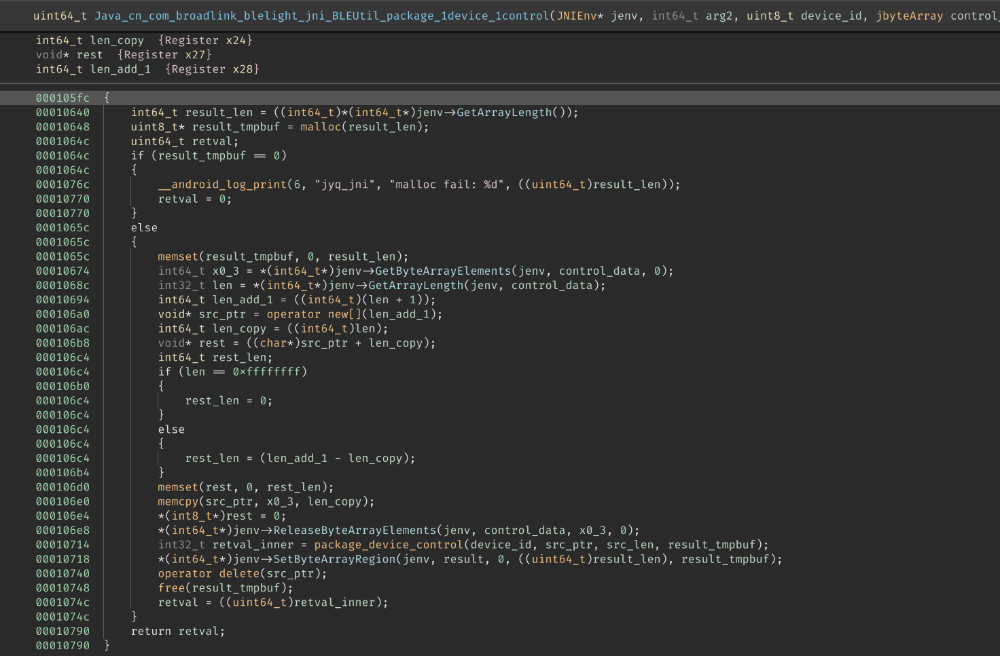
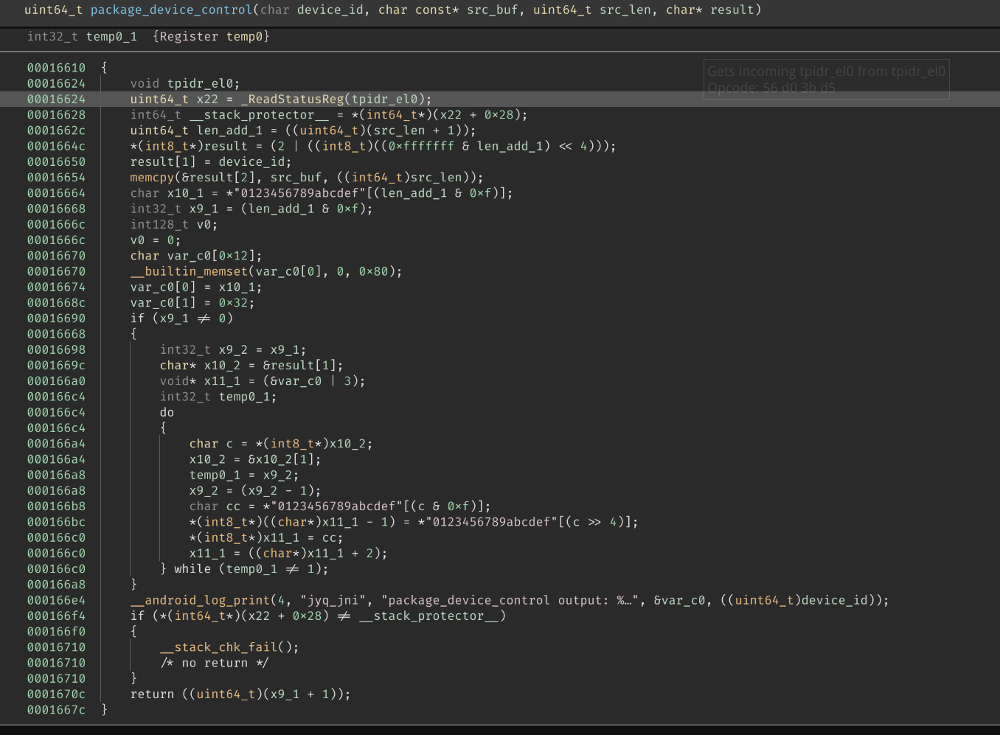
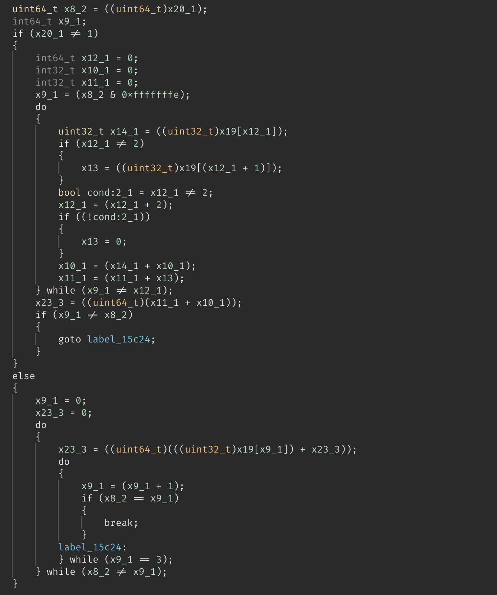
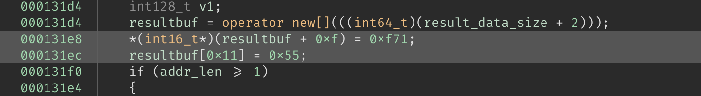
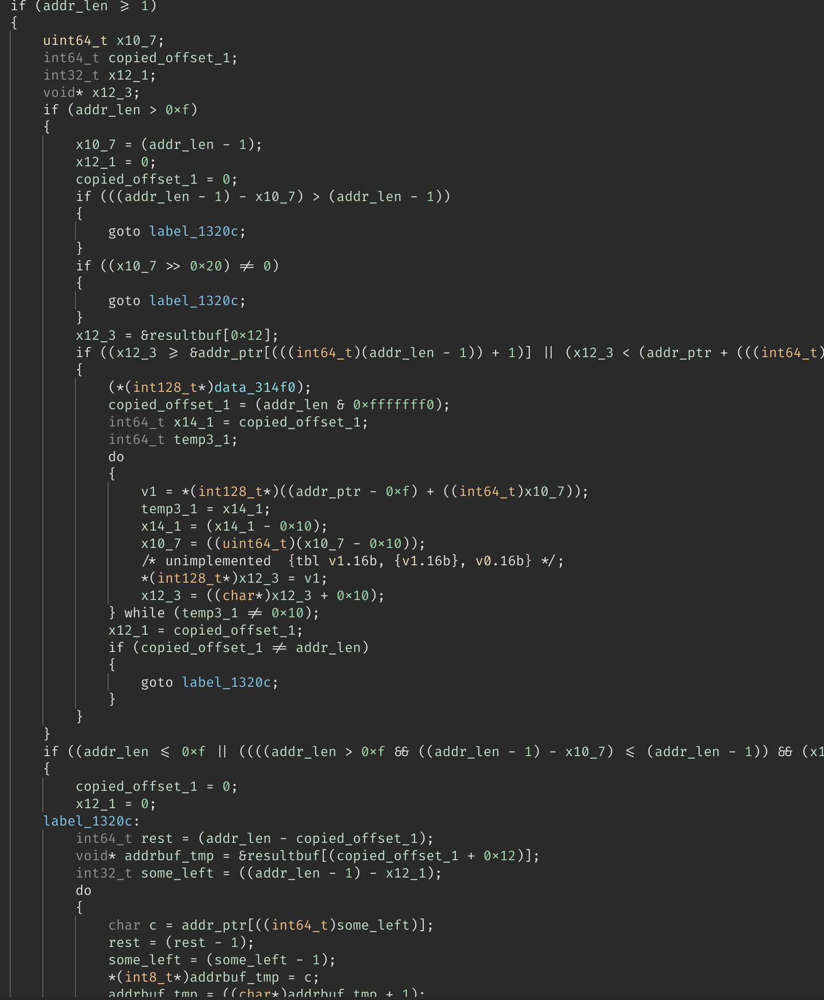
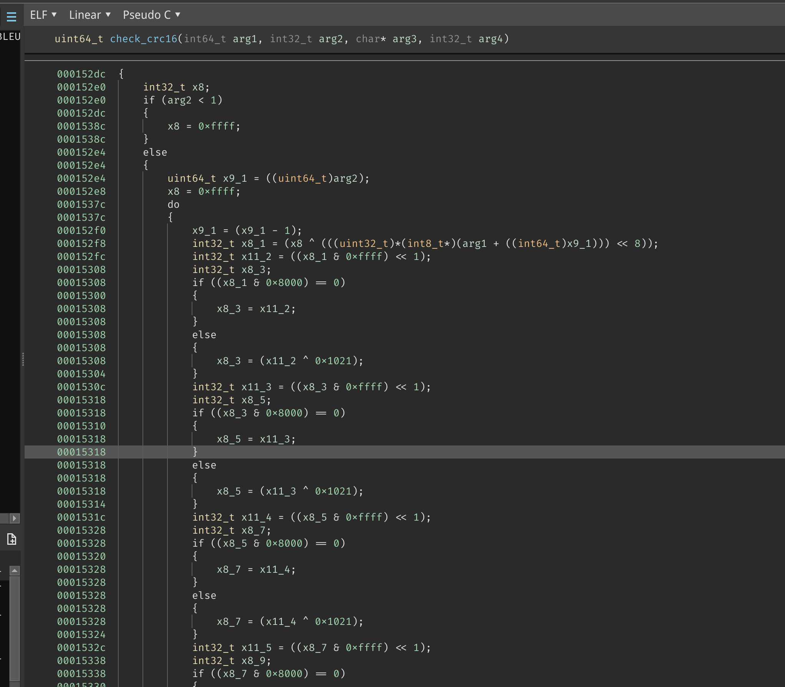
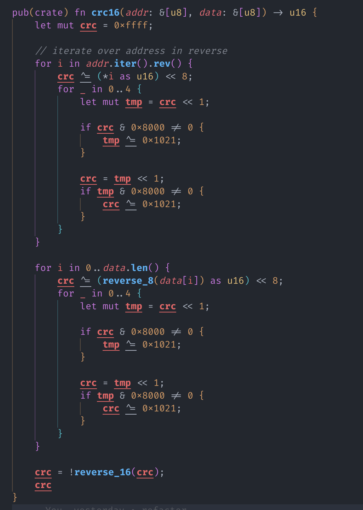
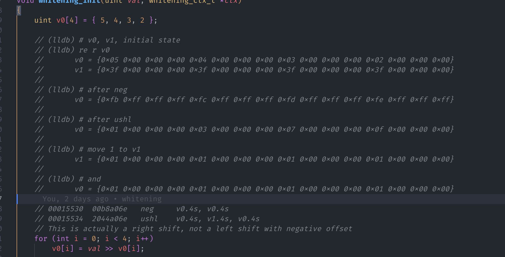
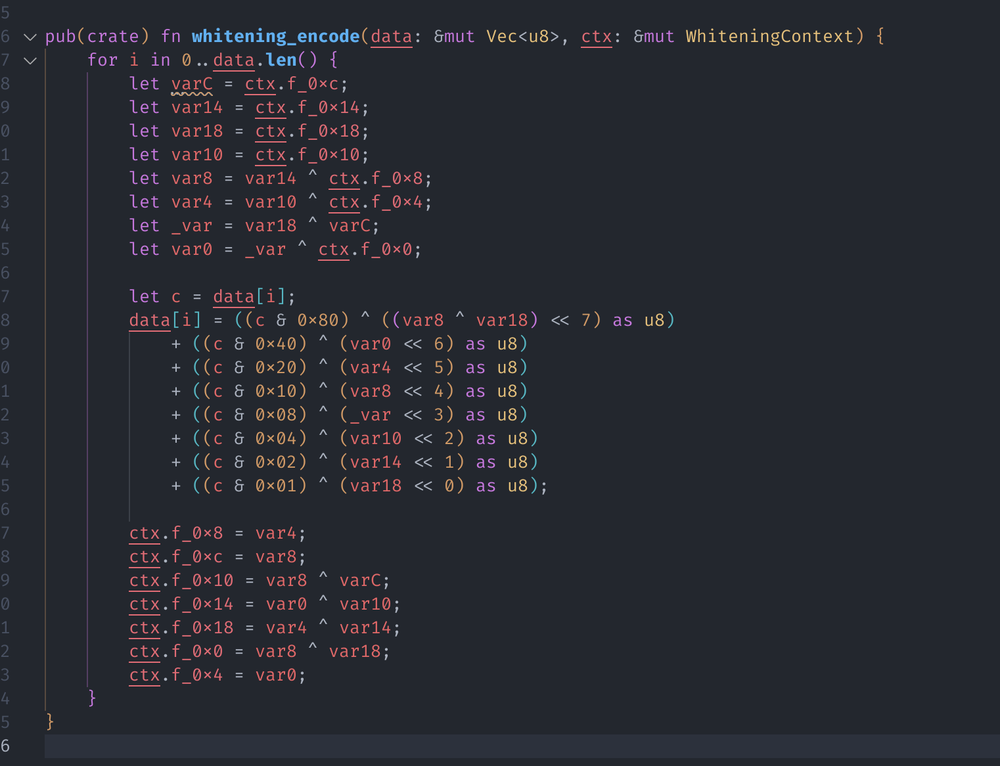

## 上回书说到……

_4.6 重写 `Parse BLE Broadcast` 和 `Send Start Scan` 花费了我整整一周的时间。_

第一步，我选择了 `Parse BLE Broadcast`，因为它是一个简单的函数，而且我已经知道了它的输入和输出。

首先就是函数签名：

```c
void parse_ble_broadcast(
    const u8 *data,         // 数据
    const size_t data_len,  // 数据长度
    const u8 *phone_key,    // 手机 Key，大概只有 4 bytes
    /* callback */          // 一些回调函数，我们在 C 里面不需要
);
```

然后根据 Binja 内的伪 C 代码，大概写出了函数的逻辑：


首先调用 `bl_ble_fastcon_header_encrty` 函数解密数据前 4 字节的头，第一个 byte 右移 4
位之后的低三位应该是 header type（也就是第 5, 6, 7 位）

如果 header type 是 1，则进入所需的 `Scan Response` 处理流程，我在代码中直接将其命名为
`DeviceAnnouncement`。

如果 header type 是 3，根据反编译结果，会调用 `bl_ble_fastcon_encrty` 函数解密剩下的数据，
并根据解密后的第一个 byte 判断内容类型，包括 `TimerUploadResponse` 和 `HeartBeat`。

似乎没有其他的 header type 了。

---

## bl_ble_fastcon_header_encrty 与 bl_ble_fastcon_encrty

接下来需要逆向出 `bl_ble_fastcon_header_encrty` 和 `bl_ble_fastcon_encrty` 函数的逻辑。


看到这里出现了 v 寄存器，于是合理猜测是一个 SIMD 优化过的循环。

因为在编译器进行 SIMD 优化时，不会假设「所有的数据均能被」 SIMD 指令处理。
因此在 SIMD 指令前后总会出现另一循环，用来处理剩余的数据，并且效果应与 SIMD 指令相同。

（所以只看另一部分非 SIMD 的循环，也能得到正确的结果）


在这里，我看到了……

```c
do
{
    *(int8_t*)((char*)arg2 + x9_1) =
        (HEADER_XOR_KEY[(x9_1 & 3)] ^ *(int8_t*)((char*)arg1 + x9_1));
    x9_1 = (x9_1 + 1);
} while (x8_1 != x9_1);
```

由此可知 `x9_1` 类似一个计数器，那么根据一般经验，`x8_1` 既然是要和 `x9_1` 比较的话，
它就应该是剩余（因为 SIMD 代码**可能**已经处理一部分了）数据的长度。

果不其然，在上面就有 `uint64_t x8_1 = ((uint64_t)arg3);` 这样的语句。

我已经知道函数的 `arg1` 的类型是 `const u8 *`，也就是输入数据，`arg2` 的类型是 `u8 *`，
也就是输出数据，那么就不难看出这段循环的作用了。

```c
for (int i = 0; i < data_len; i++) {
    out[i] = data[i] ^ HEADER_XOR_KEY[i & 3];
}
```

至此，这个函数逻辑就很清晰了，仅仅是一个简单的异或运算。

---

### bl_ble_fastcon_encrty

有了上一函数的经验，这个函数就很简单了。

同样是一个 v 寄存器，代表着 SIMD 优化过的循环，同样是 goto 到了另一个 "平凡" 的循环。

```c
label_15914:
do
{
    arg2[x9_1] = (*(int8_t*)((char*)arg4 + (x9_1 & 3)) ^ arg1[x9_1]);
    x9_1 = (x9_1 + 1);
} while (x8_1 != x9_1);
```

稍微不同的是，这里我们没有 `HEADER_XOR_KEY`，而是有一个 `arg4`。

在不经意间翻看的时候，发现了 C++ 里才会有的 `std::` 命名空间，这才发现
原来这个库是用 C++ 写的。

于是我尝试在 Binja 中显示函数 mangle 后的名字，发现是 `_Z21bl_ble_fastcon_encrtyPhS_iS_`，
那么：

```bash
$ c++filt '_Z21bl_ble_fastcon_encrtyPhS_iS_'
bl_ble_fastcon_encrty(unsigned char*, unsigned char*, int, unsigned char*)
```

我们就可以可靠地得知 `arg4` 的类型是 `const u8 *`，也就是解密所需的 key。

那么这个函数就也被成功逆向了。

```c
// 我写代码才不会用这样的格式……
// 还不是为了照顾窄屏用户
void bl_ble_fastcon_encrty(
    const u8 *src,
    u8 *dst,
    size_t size,
    const u8 *key
) {
    for (size_t i = 0; i < size; i++)
        dst[i] = key[i & 3] ^ src[i];
}
```

## Java 对应调用方的重新实现

在这种情况下，由于我的最终目标是写一个 Rust 库，所以现阶段需要做的就是直接将 Java
反编译后的代码使用 Rust 重新实现一下即可。

### 1. Java 方面的参数

接下来请欣赏反编译后的 Java 函数参数名：

```java
public String genSingleLightCommand(
    boolean z, int i, int i2, int i3, int i4, int i5, int i6,
    int i7
) {
    return genSingleLightCommand(
        z, i, i2, i3, i4, i5, i6, i7, false
    );
}

public String genSingleLightCommand(
    boolean z, int i, int i2, int i3, int i4, int i5, int i6,
    int i7, boolean z2
) {
    return genSingleLightCommand(
        z, i, i2, i3, i4, i5, i6, true, 255, i7, z2
    );
}

public String genSingleLightCommand(
    boolean z, int i, int i2, int i3, int i4, int i5, int i6,
    boolean z2, int i7, int i8, boolean z3
) {
    return genSingleLightCommand(
        z, i, i2, i3, i4, i5, i6, z2, i7, i8, z3, true
    );
}

public String genSingleLightCommand(
    boolean z, int i, int i2, int i3, int i4, int i5, int i6,
    boolean z2, int i7, int i8, boolean z3, boolean z4
);
```

看到这样的函数重载和参数，~~当时人就傻掉~~。仅有的方案就是一点一点用 rust 重写，
并无其他捷径。

---

**于是决定跳过这段无聊的重写，直接关注 native 库的逆向过程。**

---

## （再次）逆向 native 库

整个 native 库四十多个 JNI 函数，在上文仅出现了一个。因为好戏还在后头：

就拿用于控制单个等开关的函数 `singleOnOff` 为例，从封装函数开始，到最终数据被广播出去：

```java
/*Java*/ Helper.singleOnOff(int i, boolean z);
/*Java*/ Helper.singleControl(int i, String data);
/*Java*/ BLSBleLight.controlWithDevice(int i, String data, int delay);
/*Java*/ BLEFastconHelper.controlLightSingle(int i, String data, int delay);
/*C++ */ package_device_control(int, const char *, int, char *); // 打包设备控制指令
/*Java*/ BLEFastconHelper.sendCommand(int, byte[], byte[], ...);
/*Java*/ BLEFastconHelper.sendCommand(int, byte[], byte[], ...);
/*Java*/ BLEFastconHelper.doSendCommand(int, byte[], byte[], ...);
/*Java*/ BLEFastconHelper.getPayloadWithInnerRetry(int, byte[], byte[],);
/*C++ */ package_ble_fastcon_body(int, int, int, int, int, char *, int, char *, char *);
/*Java*/ BLEFastconHelper.XdoSendCommand(byte[], int, boolean, boolean, boolean);
/*C++ */ get_rf_payload(char *, int, char *, int, char *); // 获取 RF payload
/*Java*/ BluetoothLeAdvertiser.startAdvertising(...); // 终于把数据发出去了
```

其中涉及了三次 native 调用，那么就从第一个开始做吧。

## 1. package_device_control

看名字应该是用于 「打包设备控制指令」，首先打开 Binja，找到对应的 JNI 入口：



乍一看，这个函数怎么这么短？

仔细观察才发现这只是一个 wrapper，大概做的就是先 `malloc` 出一份工作用的 buffer，讲传入的 `JByteArray`
内容解包到 buffer 里，随后调用真正的函数，最后将 buffer 里的内容打包到返回用的 `JByteArray` 里。

并没有什么特别的地方，遂跳到真正的函数 `package_device_control` 去一探究竟：



函数的开头和最后几行通常是 stack smashing protector，与我们无关，所以只需要关注中间的部分：

```c
uint64_t len_add_1 = ((uint64_t)(src_len + 1));
*(int8_t*)result = (2 | ((int8_t)((0xfffffff & len_add_1) << 4)));
result[1] = device_id;
memcpy(&result[2], src_buf, ((int64_t)src_len));
char x10_1 = *"0123456789abcdef"[(len_add_1 & 0xf)];
int32_t x9_1 = (len_add_1 & 0xf);
int128_t v0;
v0 = 0;
char var_c0[0x12];
__builtin_memset(var_c0[0], 0, 0x80);
var_c0[0] = x10_1;
var_c0[1] = 0x32;
if (x9_1 != 0)
{
    int32_t x9_2 = x9_1;
    char* x10_2 = &result[1];
    void* x11_1 = (&var_c0 | 3);
    int32_t temp0_1;
    do
    {
        char c = *(int8_t*)x10_2;
        x10_2 = &x10_2[1];
        temp0_1 = x9_2;
        x9_2 = (x9_2 - 1);
        char cc = *"0123456789abcdef"[(c & 0xf)];
        *(int8_t*)((char*)x11_1 - 1) = *"0123456789abcdef"[(c >> 4)];
        *(int8_t*)x11_1 = cc;
        x11_1 = ((char*)x11_1 + 2);
    } while (temp0_1 != 1);
}
__android_log_print(4, "jyq_jni", "package_device_control output: %s...",
    &var_c0, ((uint64_t)device_id));
```

这段代码最后调用了 `__android_log_print`，那么参数 `var_c0` 就一定是某个字符串，看来看去，似乎这整个串
与我们的实际操作毫无关系，于是把代码扔到编辑器里，一个一个删变量，让 Language Server 的报错来帮忙：

最终一个个删完，只剩下了这四行代码：

```c
uint64_t len_add_1 = ((uint64_t)(src_len + 1));
*(int8_t*)result = (2 | ((int8_t)((0xfffffff & len_add_1) << 4)));
result[1] = device_id;
memcpy(&result[2], src_buf, ((int64_t)src_len));
```

看来这个 result 的第一个 byte 是长度 + 1 左移四位后与 2 取按位或，第二个 byte 是设备 id，后面的内容
就是我们传入的数据了。

（怎么这么简单？）

## 2. package_ble_fastcon_body

有了上个函数的 "经验"，我兴冲冲打开了这个函数体。

JNI 入口函数仍然是十分类似的 wrapper，首先 `malloc` 了一份 buffer，然后调用真正的函数，最后将 buffer
重新打包到返回用的 `JByteArray` 里，于是直接前往真正的函数体：`package_ble_fastcon_body`。

这个函数比上一个长很多，而且里面有很多的与上个函数内类似的 `bytes-to-hex-string` 代码：

```c
// bytes-to-hex-string 大概长这样：
// 其中，x19 是某些 char 指针，x9_12 似乎是一个计数器
// x8_12 则应该是指向 hex-string 的指针
// 值得注意的是，这里的循环似乎是两 bytes 为一组赋值，所以 x8_12 会每次增加 2
// （不过这与我们的实际操作毫无关系，只是顺便说说）
do
{
    uint64_t x10_16 = ((uint64_t)*(int8_t*)x19);
    x19 = ((char*)x19 + 1);
    temp2_1 = x9_12;
    x9_12 = (x9_12 - 1);
    char x10_18 = *"0123456789abcdef"[(x10_16 & 0xf)];
    *(int8_t*)x8_12 = *"0123456789abcdef"[(x10_16 >> 4)];
    x8_12[1] = x10_18;
    x8_12 = &x8_12[2];
} while (temp2_1 != 1);
```

在本函数体内，类似的代码出现了四次，其中两次循环后都跟有 `__android_log_print`，所以我大胆设想
这些代码都与实际操作无关。（~~另外两次为什么没 `print` 我暂且蒙在鼓里~~）

为了方便，我制作了一个 header，里面包含一些常用的 `typedef`：

```c
// 没什么特别的，也不需要保证正确，仅仅是为了方便
typedef signed char int8_t;
typedef unsigned char uint8_t;
typedef short int16_t;
typedef unsigned short uint16_t;
typedef int int32_t;
typedef unsigned int uint32_t;
typedef long long int64_t;
typedef unsigned long long uint64_t;
typedef struct
{
    int64_t __val[2];
} int128_t;

typedef struct
{
    uint64_t __val[2];
} uint128_t;

void __android_log_print(int32_t prio, const char *tag, const char *fmt, ...);
```

这样每次 copy 出来的代码就不用再改类型了，直接 include 头。

---

值得记录一下的是，Binary Ninja 将这个函数反编译成了这样：

```c
char var_100 = *"0123456789abcdef"[((uint64_t) ((x24_1 >> 4) & 0xf))];
char var_ff = *"0123456789abcdef"[(x24_1 & 0xf)];
char var_fe = *"0123456789abcdef"[((uint64_t) ((x26 >> 4) & 0xf))];
char var_fd = *"0123456789abcdef"[(x26 & 0xf)];
char x8_6 = *"0123456789abcdef"[((uint64_t) ((x25 >> 4) & 0xf))];
char x9_5 = *"0123456789abcdef"[(x25 & 0xf)];
char x10_6 = *"0123456789abcdef"[((uint64_t) ((x23_3 >> 4) & 0xf))];
char x11_5 = *"0123456789abcdef"[(x23_3 & 0xf)];
char *x27 = arg9;
v0 = 0;
int128_t var_f8;
__builtin_memset(var_f8, 0, 0x78);

// 后面：
__builtin_memset(var_100, 0, 0x80);
```

经过一段时间的研究，我认为 `var_100` 的实际类型应该是 `char[0x80]`，而上面所有的赋值应该都是
对这个数组的赋值。

---

`var_100` 似乎是专门用来存放 hex-string 的。仍然与我们的操作无关，所以干脆全部删掉。去掉了所有
SIMD 指令后，我得到了这样的代码：

第一部分：

```c
result[0] = (0x7f & ((0x8f & i2) | ((0x7 & i) << 4))) | (forward << 7);
result[1] = sequence;
result[2] = safe_key;
result[3] = 0;
memcpy(&result[4], data, data_len);
```

很明显是一些包头的赋值，不过为什么

第二部分：



第三部分：

```c
result[0] = result[0] ^ 0x5e;
result[1] = sequence ^ 0x36;
result[2] = safe_key ^ 0x7b;
result[3] = x23_3 ^ 0xc4;   // 在第二部分算出的某个结果

char *key = keyptr;

// 如果 keyptr 为 NULL，则使用（默认的） HEADER_XOR_KEY
if (key == 0)
    key = &HEADER_XOR_KEY;

if (data_len > 0)
{
    // 一些 xor 运算
    int counter = 0;
    do
    {
        data[counter] = key[counter & 3] ^ data[counter];
        counter = (counter + 1);
    } while (data_len != counter);
}

// 将 xor 的结果写入 result
memcpy(&result[4], data, data_len);
```

接下来工作的重点就是个第二部分了，在经过{数据测试，阅读 ASM，~~询问 ChatGPT~~}之后，我终于得到了
这样的结论：

- **第二部分其实就是一个 checksum，但由于 `result[3]` 是 checksum 本身，所以在循环 sum 的时候跳过了 `index = 3`**

那么这个函数的逻辑就很清晰了：

```rust
let mut body = vec![0; data.len() + 4]; // 4 bytes for header

body[0] = (i2 & 0b1111) << 0 | (i & 0b111) << 4 | u8::from(forward) << 7;
body[1] = sequence as u8;
body[2] = safe_key;
body[3] = 0; // checksum placeholder

body[4..].copy_from_slice(data);

let mut checksum: u8 = 0;
for i in 0..body.len() {
    if i == 3 {
        continue; // skip checksum itself
    }
    checksum = checksum.wrapping_add(body[i]);
}

body[3] = checksum;

// encrypt the header, the same as bl_ble_fastcon_header_encrty
for i in 0..4 {
    body[i] = DEFAULT_ENCRYPT_KEY[i & 3] ^ body[i];
}

// encrypt the body with given key
let real_key = key.unwrap_or(&DEFAULT_ENCRYPT_KEY);
for i in 0..data_size {
    body[4 + i] = real_key[i & 3] ^ body[4 + i];
}

body // return the encrypted body
```

## 3. get_rf_payload

万万想不到这个函数竟然是本期的主角，函数传入 `addr` 地址, `addr_len` 地址长度, `data` 数据, `data_len`
数据长度，最终将数据写如 `result` 返回结果。

首先映入眼帘的是两个 `whitening_init` 调用，看名字似乎是在初始化什么东西，然后是一个 `operator new[]`，
在这里申请了 `0x12 + addr_len + data_len + 2` 大小的内存。

这块内存最终被 copy 到了 `result` 内，合理猜测这就是所需的最终结果。

函数内部的逻辑很简单，看着反汇编就能把大概逻辑描述出来：

1. 这一段是对申请后的内存进行初始化，似乎在 `0x0f` 和 `0x10`, `0x11` 进行 hard-coded：

   

2. 随后是一段带有 SIMD 优化的循环，我们不管 SIMD 部分，直接跳到 `label_1320c`：

   

   ```c
   label_1320c:
   int64_t rest = (addr_len - copied_offset_1);
   char* addrbuf_tmp = &resultbuf[(copied_offset_1 + 0x12)];
   int32_t some_left = ((addr_len - 1) - x12_1);
   do
   {
       char c = addr_ptr[((int64_t)some_left)]; // c = addr[some_left]
       rest = (rest - 1);                       // rest--
       some_left = (some_left - 1);             // some_left--
       *(int8_t*)addrbuf_tmp = c;               // addrbuf_tmp[0] = c
       addrbuf_tmp = ((char*)addrbuf_tmp + 1);  // addrbuf_tmp++
   } while (rest != 0);
   ```

   不难看出这是对 `addr` 的逆序拷贝，`copied_offset_1` 和 `x12_1` 是用于记录在 SIMD
   部分已经拷贝了多少字节，因为无需关心 SIMD 部分，所以直接把他当作 0 即可。

   这段代码把 `addr` 复制到了 `resultbuf` 的 `0x12` 处。

3. 接下来是对 `data` 的拷贝，与上面不一样的是，这次的拷贝是正常顺序的：

   ```c
   label_13274:
       char* data_dst = &resultbuf[(x10_5 + (addr_len + 0x12))];
       int64_t x9_1 = (data_len_copy - x10_5);
       char* data_src = &data_ptr[x10_5];
       int64_t exit_cond;
       do
       {
           char c = *(int8_t*)data_src;
           data_src = &datasrcptr[1];
           exit_cond = x9_1;
           x9_1 = (x9_1 - 1);
           *(int8_t*)data_dst = c;
           data_dst = &data_dst[1];
       } while (exit_cond != 1);
   ```

   同样，`x10_5` 和 `data_len_copy` 是可以直接当作 0 的。

   值得注意的是，我们的 `data_dst` 是从 `resultbuf` 的 `addr_len + 0x12` 开始的，这是因为
   要将 `data` 拼接在 `addr` 之后。

4. 随后是一个奇怪的循环：

   ```c
   if ((addr_len + 3) >= 1)
   {
       // count down from addr_len + 3
       uint64_t x27_1 = ((uint64_t)(addr_len + 3));
       int8_t* x19_1 = &resultbuf[0xf];
       uint64_t temp0_1; // exit condition
       do
       {
           temp0_1 = x27_1;
           x27_1 = (x27_1 - 1);
           *x19_1 = invert_8(*(int8_t*)x19_1);
           x19_1 = ((char*)x19_1 + 1);
       } while (temp0_1 != 1);
   }
   ```

   还记得之前硬编码的 `0xf` 和 `0x10`, `0x11` 位置的数据吗，这段代码对此处从 `0xf` 开始的
   `[3 + addr_len]` 个字节进行了 "invert"。

   说到这里，就不得不提到 `invert_8` 这个函数：

   ```asm
   uint64_t invert_8(int32_t arg1)
   int32_t arg1  {Register x0}

   lsl     w11, w0, #0x5           ; w11 = w0 << 0x5
   and     w11, w11, #0x40         ; w11 = w11 & 0x40
   lsr     w10, w0, #0x2           ; w10 = w0 >> 0x2
   bfi     w11, w0, #0x7, #0x19    ; w11 = w11 | (w0 << 0x7)
   lsr     w9, w0, #0x3            ; w9 = w0 >> 0x3
   bfi     w11, w10, #0x5, #0x1    ; w11 = w11 | (w10 << 0x5)
   ubfx    w10, w0, #0x1, #0x7     ; w10 = w0 & 0x7f
   bfi     w11, w9, #0x4, #0x1     ; w11 = w11 | (w9 << 0x4)
   ubfx    w9, w0, #0x3, #0x5      ; w9 = w0 & 0x1f
   and     w10, w10, #0x8          ; w10 = w10 & 0x8
   ubfx    w12, w0, #0x5, #0x3     ; w12 = w0 & 0x7
   and     w9, w9, #0x4            ; w9 = w9 & 0x4
   orr     w10, w11, w10           ; w10 = w11 | w10
   orr     w9, w10, w9             ; w9 = w10 | w9
   and     w10, w12, #0x2          ; w10 = w12 & 0x2
   and     w8, w0, #0xff           ; w8 = w0 & 0xff
   orr     w9, w9, w10             ; w9 = w9 | w10
   orr     w0, w9, w8, lsr #0x7    ; w0 = w9 | (w8 >> 0x7)
   ret                             ; return w0
   ```

   这个函数明明做的是 `reverse`，但是却叫 `invert`，可想而知这位开发者可能在写的时候走神了：

   - `invert(0b00111111) = 0b11000000`
   - `reverse(0b00111111) = 0b11111000`

   这个 `invert_8` 函数下面还有一个 `invert_16`，于是直接当作 `reverse` 了。

5. 在 reverse 一部分 bytes 后，这个函数又计算了 `addr` 和 `data` 的 CRC-16，将得到的 16 位
   CRC 拼接在了最后（这就是为什么一开始申请内存的时候要加 2 了）：

   ```c
   const int32_t crc_start = 0x12 + addr_len + data_len;
   const int16_t crc = check_crc16(addr_ptr, addr_len, data_ptr, data_len);
   resultbuf[crc_start] = x0_5;          // crc low byte
   resultbuf[crc_start + 1] = x0_5 >> 8; // crc high byte
   ```

   这个 CRC 函数十分 sus：他接受两个 buffer，所以我严重怀疑是什么自己的轮子：

   

   这是一坨什么大便，我不想看了。

   经过千辛万苦地化简，我终于把这个函数化简成了这样：

   

6. whitening_init

   > 信号的白化是一种常见的信号处理技术，它的目的是将信号的频谱分布均匀化，使得信号的频谱
   > 更加平滑，从而使得信号更加稳定。
   > --- GitHub Copilot

   这段代码（上文提到过）涉及到了两次 `whitening_init` 调用和一次 `whitening_encode`：

   ```c
   whitening_ctx_t var_88; // 感觉像是一个 struct，但是被优化掉了
   whitening_ctx_t var_a8;
   whitening_init(0x25, &var_88);
   whitening_init(0x3f, &var_a8);

   // 在计算好 CRC 之后
   whitenging_encode(resultbuf, (result_data_size + 2), &var_88);
   ```

   很有意思的是，`var_a8` 从来没有使用过，这个变量是不是多余的呢？

   这就要去看看 `whitening_init` 有没有副作用了：

   ```asm
   ; whitening_ctx_t 是目前还不知道的一个 struct
   ; void whitening_init(int64_t arg1, whitening_ctx_t* arg2)
   ; int64_t arg1           {Register x0}
   ; whitening_ctx_t* arg2  {Register x1}

   ; 这两行把 data_31ac0 加载到 q0
   ; 在 ARM 中，q0 寄存器是一个 128 位的寄存器，用于在 SIMD 指令中存储数据
   ; 我们这里的 data_31ac0 其实就是 [5, 4, 3, 2] 四个 32 位的整数
   adrp    x8, 0x31000
   ldr     q0, [x8, #0xac0]  {data_31ac0}

   dup     v1.4s, w0            ; v1 = [arg1, arg1, arg1, arg1]
   orr     w8, wzr, #0x1        ; w8 = 0x1

   str     w8, [x1]  {0x1}      ; 将 w8 存入 x1 指向的内存（0x1 是什么我不知道）
   neg     v0.4s, v0.4s         ; v0 = ~v0
   ushl    v0.4s, v1.4s, v0.4s  ; v0 = v0 << v1
   movi    v1.4s, #0x1          ; v1 = [1, 1, 1, 1]

   ubfx    w8, w0, #0x1, #0x1       ; w8 = (w0 >> 0x1) & 0x1
   and     w9, w0, #0x1             ; w9 = w0 & 0x1
   and     v0.16b, v0.16b, v1.16b   ; v0 = v0 & v1 按位与

   stur    q0, [x1, #0x4]       ; [x1, #0x4] = v0
   stp     w8, w9, [x1, #0x14]  ; [x1] = w8, [x1, #0x8] = w9

   ; 拜拜～～～
   ret
   ```

   值得注意的是，这个先取反再左移的操作，在实际情况中其实就是右移……我被这个问题困扰了很久。
   最终甚至还在 Android 上挂了 lldb 调试，才发现了这个问题：

   

   接下来的步骤就是将其翻译为 Rust：

   ```rust
   #[derive(Debug, Clone, Copy, Default)]
   pub(crate) struct WhiteningContext {
       // 我完全不知道这些字段是什么意思，所以直接用偏移量作为字段名了
       f_0x0: u32,
       f_0x4: u32,
       f_0x8: u32,
       f_0xc: u32,
       f_0x10: u32,
       f_0x14: u32,
       f_0x18: u32,
   }

   pub(crate) fn whitening_init(val: u32, ctx: &mut WhiteningContext) {
        let v0 = [(val >> 5), (val >> 4), (val >> 3), (val >> 2)];
        ctx.f_0x0 = 1;
        ctx.f_0x4 = v0[0] & 1;
        ctx.f_0x8 = v0[1] & 1;
        ctx.f_0xc = v0[2] & 1;
        ctx.f_0x10 = v0[3] & 1;
        ctx.f_0x14 = (val >> 1) & 1;
        ctx.f_0x18 = val & 1;
   }
   ```

7. whitening_encode

   - 好消息：这是我们最后一个函数了！
   - 好消息：这个函数逻辑非常简单，没有 SIMD，没有怪异的位运算
   - 好消息：这个函数里面就一个循环，每次循环更新 data 内的一个字节，并且更新 ctx
   - 好消息：直接从 Binary Ninja 中复制出代码进行翻译即可

   甚至没有什么值得说的：

   

至此，我就完成了所需 native 函数的逆向，接下来就是将其整合并重构成一个看起来舒服的 Rust 库了。

在下一篇文章中，我大概会介绍 Fastcon 的大致逻辑。

所以，晚安～
