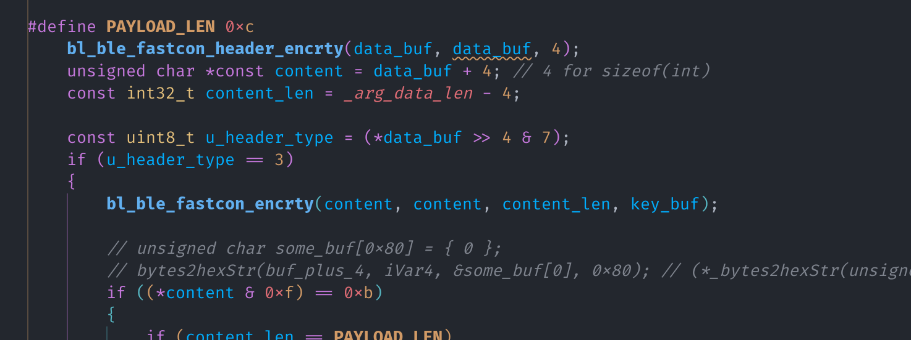
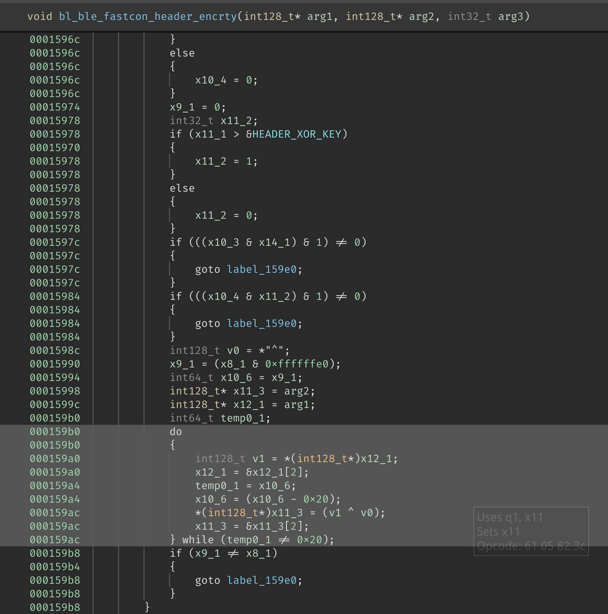
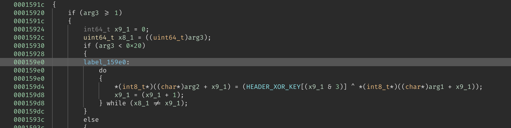

## 上回书说到……

_4.6 重写 `Parse BLE Broadcast` 和 `Send Start Scan` 花费了我整整一周的时间。_

第一步，我选择了 `Parse BLE Broadcast`，因为它是一个简单的函数，而且我已经知道了它的输入和输出。

首先就是函数签名：

```c
void parse_ble_broadcast(
    const u8 *data,         // 数据
    const size_t data_len,  // 数据长度
    const u8 *phone_key,    // 手机 Key，大概只有 4 bytes
    /* callback */          // 一些回调函数，我们在 C 里面不需要
);
```

然后根据 Binja 内的伪 C 代码，大概写出了函数的逻辑：



首先调用 `bl_ble_fastcon_header_encrty` 函数解密数据前 4 字节的头，第一个 byte 右移 4
位之后的低三位应该是 header type（也就是第 5, 6, 7 位）

如果 header type 是 1，则进入所需的 `Scan Response` 处理流程，我在代码中直接将其命名为
`DeviceAnnouncement`。

如果 header type 是 3，根据反编译结果，会调用 `bl_ble_fastcon_encrty` 函数解密剩下的数据，
并根据解密后的第一个 byte 判断内容类型，包括 `TimerUploadResponse` 和 `HeartBeat`。

似乎没有其他的 header type 了。

---

## bl_ble_fastcon_header_encrty 与 bl_ble_fastcon_encrty

接下来需要逆向出 `bl_ble_fastcon_header_encrty` 和 `bl_ble_fastcon_encrty` 函数的逻辑。



看到这里出现了 v 寄存器，于是合理猜测是一个 SIMD 优化过的循环。

因为在编译器进行 SIMD 优化时，不会假设「所有的数据均能被」 SIMD 指令处理。
因此在 SIMD 指令前后总会出现另一循环，用来处理剩余的数据，并且效果应与 SIMD 指令相同。

（所以只看另一部分非 SIMD 的循环，也能得到正确的结果）



在这里，我看到了……

```c
do
{
    *(int8_t*)((char*)arg2 + x9_1) =
        (HEADER_XOR_KEY[(x9_1 & 3)] ^ *(int8_t*)((char*)arg1 + x9_1));
    x9_1 = (x9_1 + 1);
} while (x8_1 != x9_1);
```

由此可知 `x9_1` 类似一个计数器，那么根据一般经验，`x8_1` 既然是要和 `x9_1` 比较的话，
它就应该是剩余（因为 SIMD 代码**可能**已经处理一部分了）数据的长度。

果不其然，在上面就有 `uint64_t x8_1 = ((uint64_t)arg3);` 这样的语句。

我已经知道函数的 `arg1` 的类型是 `const u8 *`，也就是输入数据，`arg2` 的类型是 `u8 *`，
也就是输出数据，那么就不难看出这段循环的作用了。

```c
for (int i = 0; i < data_len; i++) {
    out[i] = data[i] ^ HEADER_XOR_KEY[i & 3];
}
```

至此，这个函数逻辑就很清晰了，仅仅是一个简单的异或运算。

---

### bl_ble_fastcon_encrty

有了上一函数的经验，这个函数就很简单了。

同样是一个 v 寄存器，代表着 SIMD 优化过的循环，同样是 goto 到了另一个 "平凡" 的循环。

```c
label_15914:
do
{
    arg2[x9_1] = (*(int8_t*)((char*)arg4 + (x9_1 & 3)) ^ arg1[x9_1]);
    x9_1 = (x9_1 + 1);
} while (x8_1 != x9_1);
```

稍微不同的是，这里我们没有 `HEADER_XOR_KEY`，而是有一个 `arg4`。

在不经意间翻看的时候，发现了 C++ 里才会有的 `std::` 命名空间，这才发现
原来这个库是用 C++ 写的。

于是我尝试在 Binja 中显示函数 mangle 后的名字，发现是 `_Z21bl_ble_fastcon_encrtyPhS_iS_`，
那么：

```bash
$ c++filt '_Z21bl_ble_fastcon_encrtyPhS_iS_'
bl_ble_fastcon_encrty(unsigned char*, unsigned char*, int, unsigned char*)
```

我们就可以可靠地得知 `arg4` 的类型是 `const u8 *`，也就是解密所需的 key。

那么这个函数就也被成功逆向了。

```c
// 我写代码才不会用这样的格式……
// 还不是为了照顾窄屏用户
void bl_ble_fastcon_encrty(
    const u8 *src,
    u8 *dst,
    size_t size,
    const u8 *key
) {
    for (size_t i = 0; i < size; i++)
        dst[i] = key[i & 3] ^ src[i];
}
```

## Java 对应调用方的重新实现

在这种情况下，由于我的最终目标是写一个 Rust 库，所以现阶段需要做的就是直接将 Java
反编译后的代码使用 Rust 重新实现一下即可。

但在这过程中也遇到了一些问题。

睡觉了，明天再写……
