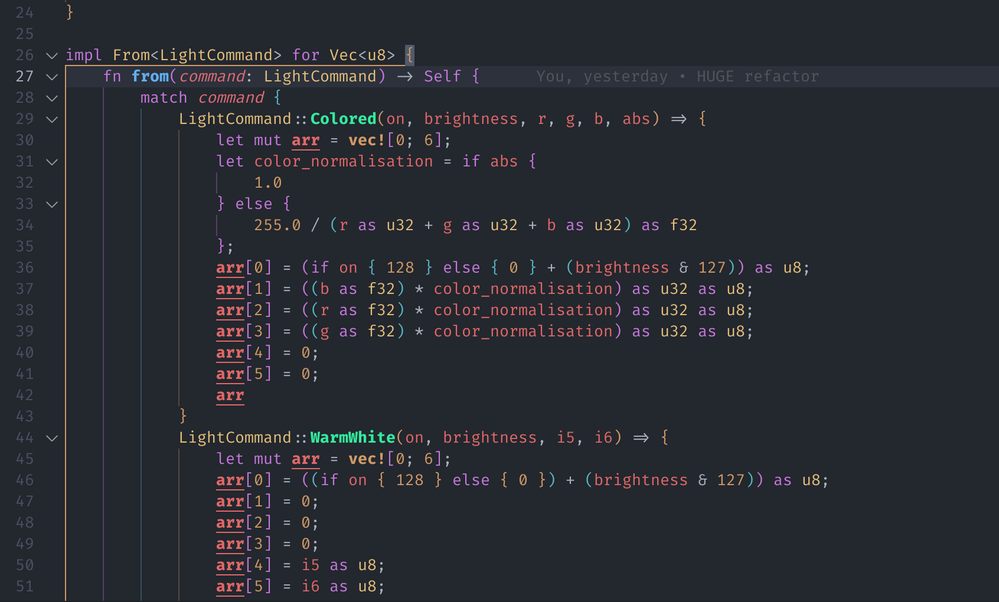
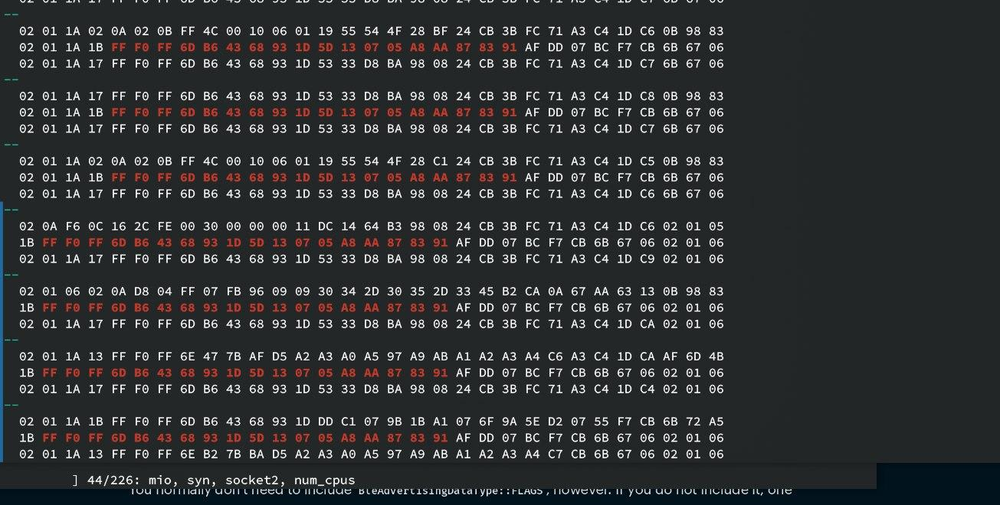

**本文内容不得用于商业用途**

## 经过了过去一周的努力，Fastcon BLE 协议终于被（大半部分）逆向出来了

目前已经可以正常控制一只灯，因为我只有这一只灯。

逆向的一些值得记录的过程，已经发在了 part 1 和 part 2 中。这里主要记录一下最后的结果，也就是
Fastcon BLE 协议本身。

## Fastcon BLE 协议

Fastcon BLE 是由 broadlink 公司（<https://www.ibroadlink.com>）于 2021 年推出的一款基于蓝牙的
通信协议。协议本身似乎有专利注册或版权保护。（因此，本文不得用于商业用途）

下文记录我对手中这只 BLE 灯的观察结果，以及我对 Fastcon BLE 协议的理解，以下内容可能随时过时，
并不保证正确性。

数据从上到下传输的过程如下：

### 0. 设备相关数据

就拿我的灯来说，大概就是这样的：



随后此数据会随 Device Address 会作为 Data 传入下一层，打包为单个设备控制包。

- Device Address 是一个 8 位无符号整数，用于标识设备

### 1. 单个设备控制包

单个设备控制包的结构如下：

```raw
| Starting Byte | Length   | Content                   |
| ------------- | -------- | ------------------------- |
| 0x1           | 0x1      | (data.len() + 1) << 4 | 2 |
| 0x2           | 0x1      | Target Device Address     |
| 0x3           | data_len | Data                      |
```

其中，`data` 是上一层传入的数据，`data_len` 是 `data.len()`，`Target Device Address`
则是上一层传入的设备地址。

可以看到，这一层中，仅仅是将数据加了一个包头，并没有做其他的处理。

### 2. BLE Fastcon 数据层

Body 未加密的内容如下：

```raw
| Starting Byte | Length   | Content                                          |
| ------------- | -------- | ------------------------------------------------ |
| 0x1           | 0x1      | (i2 & 0b1111) | (i & 0b111) << 4 | forward << 7; |
| 0x2           | 0x1      | sequence                                         |
| 0x3           | 0x1      | safe_key                                         |
| 0x4           | 0x1      | checksum                                         |
| 0x5           | data_len | Data                                             |
```

Body 的加密过程：

- 前四字节（`i2`、`sequence`、`safe_key`、`checksum`）分别与 `[0x5e, 0x36, 0x7b, 0xc4]` 进行异或运算。
- 剩下的数据（`data`），则与传入的 `key` 进行异或运算，也就是：

  ```rust
  for i in 0..data.len() {
      data[i] = key[i & 3] ^ data[i];
  }
  ```

需要注意的是：

- `i` 似乎是某些 command type，但是仍不确定
- `i2` 是设备地址除以 255 的结果，也不确定具体用途
- `forward` 是从 Java 里面抄过来的名字，依然不确定具体用途
- `sequence` 是一个 8 位循环计数器，Java 里面是从当前秒的毫秒数初始化，每次发送都会加 1
- `safe_key` 是一个 8 为数字，如果 `key` 不为空，则使用 `key` 的第三个字节，否则使用 `0xff`（即 255）
- `checksum` 是 body 内所有字节（不包含 `checksum`）的和，取低 8 位（即 `& 0xff`）

此层加密后的数据会被传入下一层。

### 3. RF Payload 层

因为我只有一只灯，所以我只能对这只灯进行分析。因此，我只能对 RF Payload 进行分析。

RF Payload 的结构如下：

```raw
| Starting Byte | Length   | Content                    |
| ------------- | -------- | -------------------------- |
| 0x1           | 0xe      | Useless                    |
| 0xf           | 0x1      | 0x71                       |
| 0x10          | 0x1      | 0x0f                       |
| 0x11          | 0x1      | 0x55                       |
| 0x12          | addr_len | Address (In Reverse Order) |
| +addr_len     | data_len | Data                       |
| +data_len     | 0x1      | CRC low                    |
| +data_len+1   | 0x1      | CRC high                   |
```

需要注意的是：

- 对于 RF，Address 固定为 `[0xC1, 0xC2, 0xC3]`
- 前面 0xe 个字节是无用的，不会被发送到设备上，但是仍然参与了下层的白化处理。只不过在最后被从 `0xf` 截断掉了。
- CRC 的计算方法建议直接看代码，~~我也不知道怎么解释~~

在此层的数据会被传入下一层，进行白化处理。

### 4. 数据白化层

白化算法见 Part 2（更建议直接看代码），这里不再赘述。

有趣的是，每个 Whitening Context 只会用于白化单个数据包，而不是整个会话，也就是说，每个数据包
都会有一个新的，一致的 Whitening Context。

白化后的数据会从 0xf 截断（也就是上文提到的无用数据），后面的数据是真正需要发送的数据。

### 5. 最底层：蓝牙广播包

协议基于的是蓝牙 BLE Advertising Packet，并使用 Manufacturer Specific Data 作为数据载体，

在我的灯上观测到 Manufacturer ID 是 0xFFF0。

## 我的收获

- 了解了 BLE 的一些基本概念，比如 Advertising Packet，Manufacturer Specific Data
- 体验了对于 ARM64 Neon 指令集的初级逆向
- 使用 Rust 进行库的编程
- 了解了编译器优化的一些细节，比如 SIMD 指令的生成
- 可以（重新）在群里直接使用 **/开灯** 了

## 番外篇：对 bluez 进行 patch

在进行逆向成果的测试过程中，我发现了一个问题：在 Linux （非 Android） 上，使用 bluez 发送的
Advertising Packet，尽管数据内容完全一致，但灯仍然无法响应。

通过使用 [raw_ble_advertise](https://github.com/quvox/raw_ble_advertise) 的 `-r` 参数，
我得以对裸数据包进行 dump，并发现：

在使用 bluez 发送包时，发送的 Flags 位于 Manufacturer Specific Data 的后面，而使用
手机（Android，iPhone）发送时，这些 flags 位于整个包的最前面：



上图中，`02 01 1A` 三个字节代表 Flags（`02` 表示长度，`01` 表示类型，`1A` 表示值），上半部分是
手机发送的包，下半部分是 bluez 发送的包，可以看到，两者的 Flags 位置不同。

那么，这个问题的解决方案就很简单了：在发送数据包时，将 Flags 放在最前面即可。

于是随手写了个 patch：

<https://github.com/moodyhunter/repo/blob/main/moody/bluez-ble-patched/hack-ble-flags.patch>

## Thanks

- 群里朋友们
- bluez 开发者们
- bluer，一个封装 Bluez 的 Rust 库
- VSCode，好用的编辑器！
- Binary Ninja，逆向工具
- Cutter/Ghidra，在某些时候能生成更简洁的反编译结果
- Rust
- 我的灯
